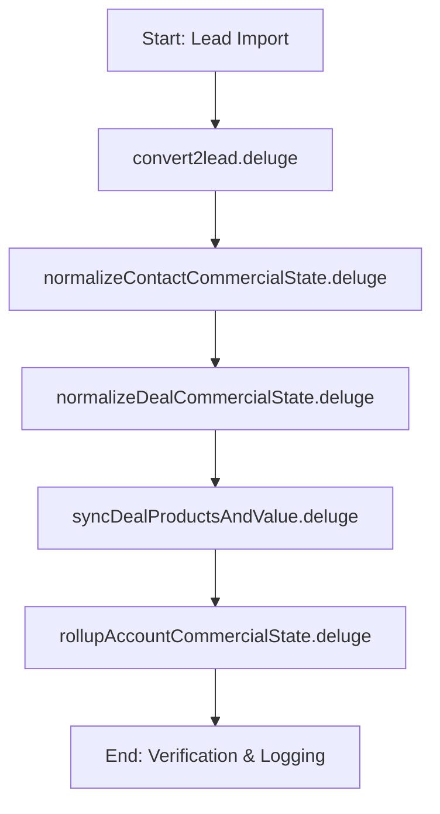

# Workflow: Deluge Refactoring & Verification Pipeline

This workflow outlines the step-by-step pipeline for refactoring, verifying, and testing the Zoho CRM Deluge functions in this workspace.

---

## Slash Command Orchestration

You can trigger this workflow inside the Antigravity workspace by referencing this plan or using the `/refactor-deluge` custom sequence.

---

## Phase-by-Phase Execution

### Phase 1: Intake & Deduplication (`convert2lead`)
*   **Persona**: Deduplication Engineer
*   **Action**: Update the intake script to normalize website domains, match emails, prevent duplicate accounts, and safely bypass non-critical validations.
*   **Verification**: Ensure that calling the function with an email or company that already exists links to the correct `AccountId` rather than spawning a new one.

### Phase 2: State Normalization (`normalizeContact` & `normalizeDeal`)
*   **Persona**: Commercial Operations Analyst
*   **Action**: Modify normalizers to support the multi-layered Opportunity $\to$ Stage ontology without requiring immediate product links. Add activity logging audits for status shifts.
*   **Verification**: Check that a Contact's transition update correctly triggers Deal modifications without reverting Stages.

### Phase 3: Product Matching & Pricing (`syncDealProductsAndValue`)
*   **Persona**: Deluge Architect
*   **Action**: Substantially rewrite product lookup to support comma-separated product staging names, query the Products catalog, and calculate prices.
*   **Verification**: Call the function with mock name inputs (e.g. `"Product A, Product B"`) and check the resulting Deal Amount.

### Phase 4: Account Aggregation (`rollupAccountCommercialState`)
*   **Persona**: Deluge Architect
*   **Action**: Update rollup function to aggregate Deal statuses onto parent Accounts, bypassing any direct Product Interest edits.

---

## Verification & 5-Row Testing Plan

After applying all modifications, verify the pipeline using the 5-Row test suite:

1.  **Row 1 (Deduplication)**: 2 Leads with the same company/domain $\to$ Converted successfully, **1 Account** reused, no duplicates.
2.  **Row 2 (Consent Gap)**: Lead with missing Marketing Consent $\to$ Converted to `MQL` / `Marketing Consent` stage without errors.
3.  **Row 3 (Consent Captured)**: Lead with captured Marketing Consent $\to$ Converted and automatically advanced to `SQL` / `Demo Booking`.
4.  **Row 4 (No Product Staging)**: Lead at `Commercials Sent` stage with blank product interests $\to$ Converted successfully, Deal Stage preserved, Deal Amount remains `0.0` or empty.
5.  **Row 5 (Product Value Calculation)**: Lead with Product Interest names matching Products in catalog $\to$ Converted successfully, Deal Amount calculated and updated.
