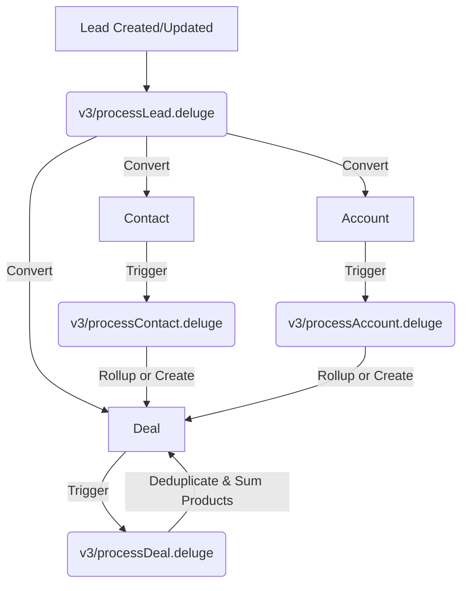

# Zoho CRM Deluge Commercial Operations Automation

This repository houses the suite of **Zoho CRM Deluge** custom functions designed to run a robust, automated sales pipeline. The core objective is to treat **Leads** as transient staging inputs and process them into canonical CRM records (**Contacts, Accounts, Deals, and Products**), keeping aggregate values and status gates automatically in sync.

---

## 1. Commercial Architecture Pipeline

The diagram below illustrates how intake leads are processed, converted, and normalized throughout the CRM entities.

---

## 2. Commercial Ontology Map

The pipeline enforces a strict four-tiered commercial ontology to standardize operations.

### Active Commercial Motions (`Opportunity`)
*   `MQL` (Marketing Qualified Lead): Initial intake or marketing consent capture phase.
*   `SQL` (Sales Qualified Lead): Validated consent or booked/attended demo.
*   `FTP` (First Time Purchase): Moving into commercial negotiations and sent contracts.
*   `RTP` (Retention Purchase): Signed contracts, onboarding, or renewal periods.

### Progression Stages (`Stage`)
The progression stages map directly to active commercial motions:
$$\text{Marketing Consent} \to \text{Demo Booking} \to \text{Demo Booked} \to \text{Demo Attended} \to \text{Commercials Sent} \to \text{Commercials Signed} \to \text{Onboarding} \to \text{Renewal}$$

### Record Status & States
*   **State**: Must be either `Open` or `Lost` (Do **not** use "Won" as a persistent state; winning a gate simply opens the next commercial motion).
*   **Status**: 
    *   `Closed`: Set only when State is `Lost`.
    *   `Working`: Set when at least one manual activity (Tasks, Calls, Events, or Notes) exists.
    *   `New`: Default status when no human interaction has occurred.

---

## 3. Deluge Script Directory & Deep Dive

The automation has been strictly refactored into the **v3** architecture, consisting of 4 isolated, idempotent functions. Each function is explicitly tied to one entity's workflow and fully reconciles CRM state around that triggering object without calling the other functions.

### 1. `v3/processLead.deluge`
*   **Trigger**: Lead Created or Updated.
*   **Purpose**: Validates the Lead, safely converts it, enriches the Contact, and orchestrates initial Deal creation.
*   **Deduplication**: Identifies Account and Contact canonical IDs to prevent duplication on conversion.
*   **Deal Logic**: Safely stages Deal_Key and creates the initial Deal organically using `Opportunity` and `Stage` from the Lead, immediately searching back by `Deal_Key` to survive bulk race conditions.

### 2. `v3/processContact.deluge`
*   **Trigger**: Contact Created or Updated.
*   **Purpose**: Person-level commercial normalization. Ensures the Contact has a parent Account and an active Deal.
*   **Deal Logic**: Gathers all sibling Contacts under the Account to find the furthest `bestStage` and `bestOpp`, then provisions or rolls up the canonical Deal.

### 3. `v3/processAccount.deluge`
*   **Trigger**: Account Created or Updated.
*   **Purpose**: Account-level aggregate state and status orchestration.
*   **Deal Logic**: Checks for an active Deal under the Account. If one is missing, it aggregates Contact stages and creates the canonical Deal.

### 4. `v3/processDeal.deluge`
*   **Trigger**: Deal Created or Updated.
*   **Purpose**: Deal deduplication, product tracking, and amount summation.
*   **Key Operations**:
    *   **Duplicate Silencing**: Instantly identifies and marks duplicate Deals (created during race conditions) as "Lost" / "Duplicate", preserving exactly one active Deal per Account.
    *   **Product Sync**: Merges product signals across all related Contacts and the current Deal, searches the `Products` catalog, and sums up unit prices to automatically set the `Amount` field.

---

## 4. Loop Prevention & Best Practices

To prevent cascading execution loops, workflows must only trigger on **source fields** and never on fields populated by the custom functions themselves.

| Source/Trigger Fields (Safe) | Calculated Fields (Never Trigger On) |
| :--- | :--- |
| `Stage` | `Opportunity` |
| `Marketing_Consent` | `State` |
| `Lost_Reasons` | `Status` |
| `Product_Interest_Staging` | `Amount` |
| `Ready_For_Commercials` | `Expected_Revenue` |
| `Demo_Outcome` | |
