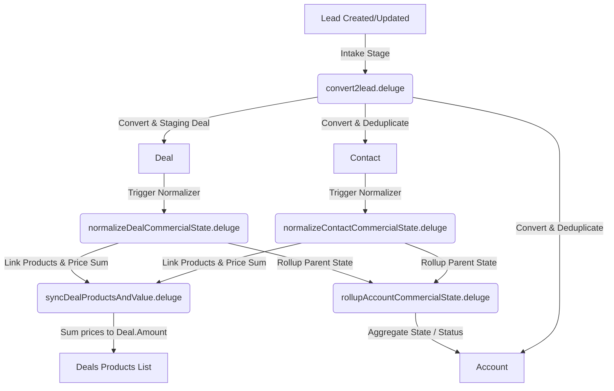

# Zoho CRM Deluge Commercial Operations Automation

This repository houses the suite of **Zoho CRM Deluge** custom functions designed to run a robust, automated sales pipeline. The core objective is to treat **Leads** as transient staging inputs and process them into canonical CRM records (**Contacts, Accounts, Deals, and Products**), keeping aggregate values and status gates automatically in sync.

---

## 1. Commercial Architecture Pipeline

The diagram below illustrates how intake leads are processed, converted, and normalized throughout the CRM entities.

---

## 2. Commercial Ontology Map

The pipeline enforces a strict four-tiered commercial ontology to standardize operations.

### Active Commercial Motions (`Opportunity`)
*   `MQL` (Marketing Qualified Lead): Initial intake or marketing consent capture phase.
*   `SQL` (Sales Qualified Lead): Validated consent or booked/attended demo.
*   `FTP` (First Time Purchase): Moving into commercial negotiations and sent contracts.
*   `RTP` (Retention Purchase): Signed contracts, onboarding, or renewal periods.

### Progression Stages (`Stage`)
The progression stages map directly to active commercial motions:
$$\text{Marketing Consent} \to \text{Demo Booking} \to \text{Demo Booked} \to \text{Demo Attended} \to \text{Commercials Sent} \to \text{Commercials Signed} \to \text{Onboarding} \to \text{Renewal}$$

### Record Status & States
*   **State**: Must be either `Open` or `Lost` (Do **not** use "Won" as a persistent state; winning a gate simply opens the next commercial motion).
*   **Status**: 
    *   `Closed`: Set only when State is `Lost`.
    *   `Working`: Set when at least one manual activity (Tasks, Calls, Events, or Notes) exists.
    *   `New`: Default status when no human interaction has occurred.

---

## 3. Deluge Script Directory & Deep Dive

The automation is divided into 5 modular Deluge custom functions.

### 1. Intake Processor: `convert2lead.deluge`
*   **Trigger**: Lead Created or Updated.
*   **Purpose**: Validates conversion readiness and safely processes the Lead into Contact, Account, and Deal records.
*   **Deduplication Trees**:
    1.  **Contact lookup**: Searches first by `Email`, then falls back to `Phone`.
    2.  **Account lookup**: Implements a strict priority lookup to prevent duplicate Accounts:
        *   Linked Account from matched Contact.
        *   Account matching normalized Company name.
        *   Account matching Website domain.
        *   Fallback name: `Unknown Account - {Lead ID}`.
*   **Data Integrity Mapping**:
    *   **Phone Mapping**: Maps Lead `Phone` to Contact `Phone` only (**never** Account `Phone`).
    *   **Website Domain Normalization**: Lowercases URLs and strips `https://`, `http://`, `www.`, and trailing `/` to ensure clean lookups.
    *   **Product Interest Staging**: Treats Lead product interest as staging plain-text names to prevent lookup insertion errors.

### 2. Contact State Normalizer: `normalizeContactCommercialState.deluge`
*   **Trigger**: Contact Created or Updated (or called from `convert2lead`).
*   **Purpose**: Normalizes Contact `Stage`, `State`, and `Status` fields and orchestrates Deal generation or reuse.
*   **Key Operations**:
    *   Examines related `Calls`, `Events`, `Tasks`, and `Notes` to dynamically set status to `Working` if active.
    *   Resolves the furthest stage among all Contacts under the parent Account.
    *   Scans related Deals to find the best open, product-matching Deal for reuse.
    *   Builds or updates the Deal and delegates execution to `syncDealProductsAndValue` and `rollupAccountCommercialState`.

### 3. Deal State Normalizer: `normalizeDealCommercialState.deluge`
*   **Trigger**: Deal Created or Updated.
*   **Purpose**: Validates commercial readiness gates, maps direct Deal edits to target opportunities, and rolls up contact stages.
*   **Key Operations**:
    *   Permits manual stage updates as source inputs, translating them to active opportunities.
    *   Aggregates the statuses of all related Account Contacts.
    *   **No Backward Roll**: Prevents related Contacts from rolling a Deal stage backward below its direct target stage.
    *   Triggers downstream Product syncs and Account rollups.

### 4. Product Syncer & Pricing Engine: `syncDealProductsAndValue.deluge`
*   **Trigger**: Called by Contact/Deal normalizers, or Deal `Product_Interest` changes.
*   **Purpose**: Queries products, associates them with the Deal, and aggregates their financial value.
*   **Key Operations**:
    *   Reads the `Product_Interest` lookup on the Deal.
    *   Checks the `Products` related list (junction object) for the Deal.
    *   If the product is not linked yet, links it via `zoho.crm.updateRelatedRecord`.
    *   Retrieves all linked Products, fetches their full catalog details, sums their `Unit_Price`, and updates Deal `Amount`.
    *   Includes a fallback calculation that parses pricing directly from the lookup if the related list query fails.

### 5. Account Aggregator: `rollupAccountCommercialState.deluge`
*   **Trigger**: Account Created/Updated, or called by normalizers.
*   **Purpose**: Dynamically rolls up commercial values and operational status onto the parent Account record.
*   **Key Operations**:
    *   **Account State**: Automatically sets to `Open` if **any** associated Deal is `Open`. Sets to `Lost` **only** if all related Deals are marked `Lost`.
    *   **Account Status**: Sets to `Closed` if State is `Lost`. Sets to `Working` if any open Deal is `Working`. Otherwise, defaults to `New`.
    *   **Product Rollup**: Pulls product interest from the furthest open Deal and updates the Account *only if* the Account product interest field is currently empty.

---

## 4. Loop Prevention & Best Practices

To prevent cascading execution loops, workflows must only trigger on **source fields** and never on fields populated by the custom functions themselves.

| Source/Trigger Fields (Safe) | Calculated Fields (Never Trigger On) |
| :--- | :--- |
| `Stage` | `Opportunity` |
| `Marketing_Consent` | `State` |
| `Lost_Reasons` | `Status` |
| `Product_Interest (Staging)` | `Amount` |
| `Ready_For_Commercials` | `Expected_Revenue` |
| `Demo_Outcome` | |
