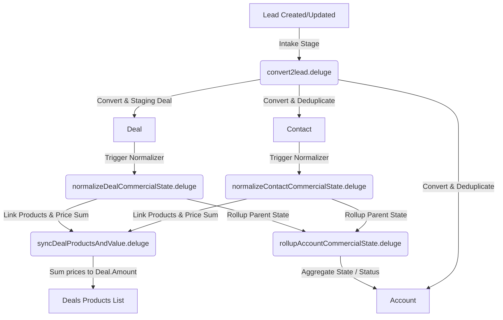

# Zoho CRM Deluge Commercial Operations Automation

This repository houses the suite of **Zoho CRM Deluge** custom functions designed to run a robust, automated sales pipeline. The core objective is to treat **Leads** as transient staging inputs and process them into canonical CRM records (**Contacts, Accounts, Deals, and Products**), keeping aggregate values and status gates automatically in sync.

---

## 1. Commercial Architecture Pipeline

The diagram below illustrates how intake leads are processed, converted, and normalized throughout the CRM entities.

---

## 2. Commercial Ontology Map

The pipeline enforces a strict four-tiered commercial ontology to standardize operations.

### Active Commercial Motions (`Opportunity`)
*   `MQL` (Marketing Qualified Lead): Initial intake or marketing qualification phase.
*   `SQL` (Sales Qualified Lead): Validated consent or booked/attended demo.
*   `FTP` (First Time Purchase): Moving into commercial negotiations and sent contracts.
*   `RTP` (Retention Purchase): Signed contracts, onboarding, or renewal periods.

### Progression Stages (`Stage`)
The progression stages map directly to active commercial motions:
$$\text{Marketing Qualification} \to \text{Demo Booking} \to \text{Demo Confirmation} \to \text{Demo Hosted} \to \text{Proposal Preparation} \to \text{Commercial Agreement} \to \text{Onboarding} \to \text{Renewal}$$

### Record Status & States
*   **State**: Must be either `Open` or `Lost` (Do **not** use "Won" as a persistent state; winning a gate simply opens the next commercial motion).
*   **Status**: 
    *   `Closed`: Set only when State is `Lost`.
    *   `Working`: Set when at least one manual activity (Tasks, Calls, Events, or Notes) exists.
    *   `New`: Default status when no human interaction has occurred.

---

## 3. Deluge Script Directory & Deep Dive

The automation is divided into 5 modular Deluge custom functions.

### 1. Intake Processor: `convert2lead.deluge`
*   **Trigger**: Lead Created or Updated.
*   **Purpose**: Implements an **always-convert policy**. Missing fields (e.g. Website, Industry, Phone, Consent, Product Interest) never block conversion. If absolute minimum Zoho fields (Last Name, Company) are empty, fallbacks are derived and pre-updated to ensure successful conversion.
*   **Deduplication Trees**:
    1.  **Contact lookup**: Searches first by `Email`, then falls back to `Phone`.
    2.  **Account lookup**: Implements a strict priority lookup to prevent duplicate Accounts:
        *   Linked Account from matched Contact.
        *   Account matching derived `Account_Key` if present on Lead.
        *   Account matching normalized Company name.
        *   Account matching normalized Website domain.
        *   Account matching normalized domain as Account Name.
        *   Fallback name: `Unknown Account - {Lead ID}`.
*   **Data Integrity Mapping**:
    *   **Phone Mapping**: Lead's default `Phone` field (labeled 'Company Phone') maps strictly to `Account.Phone`.
    *   **Website Domain Normalization**: Standardizes website/company URLs to lowercase and strips protocols (`http://`, `https://`), subdomains (`www.`), trailing slashes, and paths after the slash.
    *   **Product Interest**: Lead `Product_Interest` (Multiselect text) and `Products_Linked` (Multi-Select Lookup to Product records) are read as staging inputs. The canonical product set lives on the Deal as the `Products` related list, not as a Deal-level field. There is no `Product_Interest_Staging` field.
    *   **Deal Matching & Reusability**: Reuses an existing Deal under the Account matching the same product staging signal, or the furthest `Open` Deal, or the furthest `Lost` Deal, fallback to creating a new one if none matches.

### 2. Contact State Normalizer: `normalizeContactCommercialState.deluge`
*   **Trigger**: Contact Created or Updated (or called from `convert2lead`).
*   **Purpose**: Normalizes Contact Stage, State, and Status fields and orchestrates Deal generation or reuse.
*   **Key Operations**:
    *   Examines related Calls, Events, Tasks, and Notes to dynamically set status to `Working` if active, else `New` or `Closed`.
    *   Applies Opportunity and Stage gates (capturing Marketing Qualification, Commercial readiness, etc.).
    *   **Regression Prevention**: Rollup Contact Stage to Deal Stage ONLY if the contact's stage rank is **higher** than the Deal's current stage rank. Related Contacts can never demote/move a Deal stage backward.
    *   Triggers `syncDealProductsAndValue` and `rollupAccountCommercialState`.

### 3. Deal State Normalizer: `normalizeDealCommercialState.deluge`
*   **Trigger**: Deal Created or Updated.
*   **Purpose**: Validates commercial readiness gates, maps direct Deal edits to target opportunities, and rolls up contact stages.
*   **Key Operations**:
    *   Permits manual stage updates as source inputs, translating them to active opportunities.
    *   **Regression Prevention**: Prevents associated Contacts under the Account from rolling a Deal stage backward below its direct target stage.
    *   Triggers downstream Product syncs and Account rollups.

### 4. Product Syncer & Pricing Engine: `syncDealProductsAndValue.deluge`
*   **Trigger**: Called by Contact/Deal normalizers.
*   **Purpose**: Queries products, associates them with the Deal, and aggregates their financial value.
*   **Key Operations**:
    *   Reads the Deal's `Products` related list for already-staged product names.
    *   Aggregates Lead `Product_Interest` (text) / `Products_Linked` (lookup) and Contact `Product_Interest` (Multi-Select Lookup) as additional staging signals.
    *   Queries the `Products` module by `Product_Name` matching each staging name.
    *   Sums up their matching catalog price (`Unit_Price`) and updates Deal `Amount`.
    *   Gracefully returns without failure if no matching product is found.

### 5. Account Aggregator: `rollupAccountCommercialState.deluge`
*   **Trigger**: Called by normalizers.
*   **Purpose**: Dynamically rolls up commercial values and operational status onto the parent Account record.
*   **Key Operations**:
    *   **Account State**: Automatically sets to `Open` if **any** associated Deal is `Open`. Sets to `Lost` **only** if all related Deals are marked `Lost`.
    *   **Account Status**: Sets to `Closed` if State is `Lost`. Sets to `Working` if any open Deal is `Working`. Otherwise, defaults to `New`.
    *   **Product Rollup**: Account-level Product Interest writes are disabled for now.

---

## 4. Workflow Rules & Triggers

The automation logic is triggered by Zoho CRM Workflow Rules. All rules are configured to fire on **Create or Edit (Update)** for **All Records**.

### v3 Workflows (Module-Based)
*   **Lead**: Triggers `processLead.deluge`
*   **Contact**: Triggers `processContact.deluge`
*   **Account**: Triggers `processAccount.deluge`
*   **Deal**: Triggers `processDeal.deluge`

### v2 Workflows (Function-Based)
*   **Convert to Lead**: Triggers `convert2lead.deluge`
*   **normalizeContactCommercialState**: Triggers `normalizeContactCommercialState.deluge`
*   **normalizeDealCommercialState**: Triggers `normalizeDealCommercialState.deluge`
*   **rollupAccountCommercialState**: Triggers `rollupAccountCommercialState.deluge`
*   **syncDealProductsAndValue**: Triggers `syncDealProductsAndValue.deluge`
*(Note: The standard "Big Deal Rule" workflow is not associated with this custom v2 automation suite).*

---

## 5. Loop Prevention & Best Practices

To prevent cascading execution loops, workflows must only trigger on **source fields** and never on fields populated by the custom functions themselves.

| Source/Trigger Fields (Safe) | Calculated Fields (Never Trigger On) |
| :--- | :--- |
| `Stage` (custom, UI label "Stage") | `Stage` (standard, UI label "Opportunity") |
| `Marketing_Consent` | `State` |
| `Lost_Reasons` | `Status` |
| `Product_Interest` | `Amount` |
| `Products_Linked` (Leads) | `Expected_Revenue` |
| `Reason_For_Loss__s` | |

---

## 6. Workspace Context & Reference Data

To guide development, testing, and agent behaviors, this repository includes core context, schemas, example records, and system specifications:

*   **API Field Reference**: [.agents/context/api_field_names](file:///c:/Development/Projects/zoho-functions/.agents/context/api_field_names) contains canonical CSV exports of API names for fields and related lists (Accounts, Contacts, Deals, and Leads).
*   **Example CRM Data**: [.agents/context/example_data](file:///c:/Development/Projects/zoho-functions/.agents/context/example_data) contains CSV exports of matched sample entities demonstrating how normalized fields are constructed.
*   **Test Data Sets**: [.agents/context/test_data](file:///c:/Development/Projects/zoho-functions/.agents/context/test_data) contains test upload lists used to validate lead ingestion and workflow trigger rules.
*   **System Convergence Spec**: [spec.md](file:///c:/Development/Projects/zoho-functions/spec.md) defines the authoritative architectural specifications for deduplication logic, stage/opportunity progression mappings, and the invariant rules that all Deluge automations must preserve.

