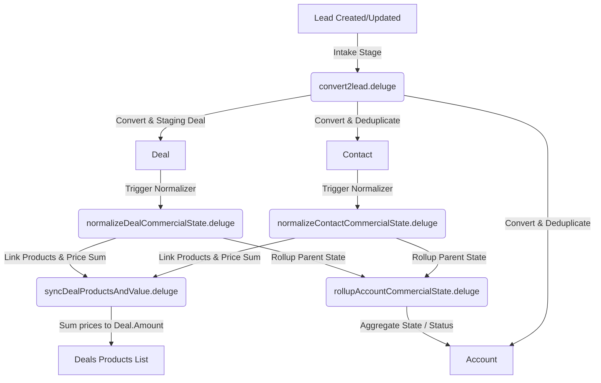

# Zoho CRM Deluge Commercial Operations Automation

This repository houses the suite of **Zoho CRM Deluge** custom functions designed to run a robust, automated sales pipeline. The core objective is to treat **Leads** as transient staging inputs and process them into canonical CRM records (**Contacts, Accounts, Deals, and Products**), keeping aggregate values and status gates automatically in sync.

---

## 1. Commercial Architecture Pipeline

The diagram below illustrates how intake leads are processed, converted, and normalized throughout the CRM entities.

---

## 2. Commercial Ontology Map

The pipeline enforces a strict four-tiered commercial ontology to standardize operations.

### Active Commercial Motions (`Opportunity`)
*   `MQL` (Marketing Qualified Lead): Initial intake or marketing qualification phase.
*   `SQL` (Sales Qualified Lead): Validated consent or booked/attended demo.
*   `FTP` (First Time Purchase): Moving into commercial negotiations and sent contracts.
*   `RTP` (Retention Purchase): Signed contracts, onboarding, or renewal periods.

### Progression Stages (`Stage`)
The progression stages map directly to active commercial motions:
$$\text{Marketing Qualification} \to \text{Demo Booking} \to \text{Demo Confirmation} \to \text{Demo Hosted} \to \text{Proposal Preparation} \to \text{Commercial Agreement} \to \text{Onboarding} \to \text{Renewal}$$

### Record Status & States
*   **State**: Must be either `Open` or `Lost` (Do **not** use "Won" as a persistent state; winning a gate simply opens the next commercial motion).
*   **Status**: 
    *   `Closed`: Set only when State is `Lost`.
    *   `Working`: Set when at least one manual activity (Tasks, Calls, Events, or Notes) exists.
    *   `New`: Default status when no human interaction has occurred.

---

## 3. Deluge Script Directory & Deep Dive (v5)

The automation in `v5` is divided into modular Deluge custom functions.

### 1. Intake Processor: `v5/processLead.deluge`
*   **Trigger**: Lead Created or Updated.
*   **Purpose**: Implements an **always-convert policy**. Missing fields (e.g. Website, Phone, Product Interest) never block conversion.
*   **Deduplication Trees**:
    1.  **Contact lookup**: Searches first by `Email`, then falls back to `Phone`.
    2.  **Account lookup**: Priority tree (Contact lookup → `Account_Key` → Company Name → Website).
*   **Key Operations**:
    *   Maps Lead `Imported_Record_Type` to `Contacts.Contact_Source_Class` and `Accounts.Account_Source_Class`.
    *   Resolves proposed sequence routing mode first: if Deal `Sequence_Status` is empty, determine `Sequence_Action_Mode` and set `Sequence_Status = "Not Started"` before running the sequence router.

### 2. Contact State Normalizer: `v5/processContact.deluge`
*   **Trigger**: Contact Created or Updated.
*   **Purpose**: Normalizes Contact Stage, State, and Status fields. Prevents stage rank regression.

### 3. Account Aggregator: `v5/processAccount.deluge`
*   **Trigger**: Account Created or Updated.
*   **Purpose**: Rolls up commercial values and operational status onto the parent Account record. Sets `State = Open` if any Deal is `Open`.

### 4. Deal State Normalizer: `v5/processDeal.deluge`
*   **Trigger**: Deal Created or Updated.
*   **Purpose**: Validates commercial readiness gates, maps direct Deal edits to target opportunities, and rolls up contact stages.

### 5. Sequence Router: `v5/activity/sequenceRouter.deluge`
*   **Trigger**: Called from `processLead` hook and workflow rules (WF002/WF003/WF010).
*   **Purpose**: State-machine routing engine. Determines if the sequence needs activation gating (`Manual Review First` or blank route) and schedules the appropriate sequence (Call First, Email First, Meeting First, Task First).

### 6. Task Completion Handler: `v5/activity/handleTaskCompletion.deluge`
*   **Trigger**: Called from Task Completion (WF008).
*   **Purpose**: Processes sequence task completions, mapping `Sequence Activation` outcomes (`Activate Call First`, `Activate Email First`, `Manual Only`, `Suppress`, `Already Handled`, `Stage Incorrect`) to Deal state changes. Implements strict idempotency checks.

---

## 4. Workflow Rules & Triggers (v5)

The automation logic is triggered by Zoho CRM Workflow Rules. All rules are configured to fire on **Create or Edit (Update)** for **All Records**.

### v5 Workflows
*   **Lead (WF001)**: Triggers `v5/processLead.deluge` to convert leads and resolve proposed routes.
*   **Deal Sequence Router (WF002)**: Triggers `v5/activity/sequenceRouter.deluge` when `Sequence_Status = "Not Started"`. Resolves and bootstraps the sequence mode (Task-gating unresolved/Manual modes, creating Calls for Call-first, sending Email 1 + creating follow-up Call 1 for Email-first).
*   **Deal Stage Change Router (WF003)**: Triggers `v5/activity/sequenceRouter.deluge` on `Stage1` changes to supersede the old sequence and restart with the default action mode for the new Stage.
*   **Task Completion Handler (WF008)**: Triggers `v5/activity/handleTaskCompletion.deluge` on task completion or outcome setting. Handles `Sequence Activation` task outcomes to confirm and activate routes.
*   **Call Outcome Handler (WF006)**: Triggers `v5/activity/handleCallOutcome.deluge` when sequence calls are completed. Handles progression semantics for Call-first and Email-first cadences.
*   **Date-Based Follow-Up Router (WF010)**: Triggers `v5/activity/sequenceRouter.deluge` at `Next_Action_Due_Date` or `Sequence_Paused_Until`.

---

## 5. Loop Prevention & Best Practices

To prevent cascading execution loops, workflows must only trigger on **source fields** and never on fields populated by the custom functions themselves.

| Source/Trigger Fields (Safe) | Calculated Fields (Never Trigger On) |
| :--- | :--- |
| `Stage` (custom, UI label "Stage") | `Stage` (standard, UI label "Opportunity") |
| `Marketing_Consent` | `State` |
| `Lost_Reasons` | `Status` |
| `Product_Interest` | `Amount` |
| `Products_Linked` (Leads) | `Expected_Revenue` |
| `Reason_For_Loss__s` | |

---

## 6. Workspace Context & Reference Data

To guide development, testing, and agent behaviors, this repository includes core context, schemas, example records, and system specifications:

*   **API Field Reference**: [.agents/context/api_field_names](file:///c:/Development/Projects/zoho-functions/.agents/context/api_field_names) contains canonical CSV exports of API names for fields and related lists (Accounts, Contacts, Deals, and Leads).
*   **Example CRM Data**: [.agents/context/example_data](file:///c:/Development/Projects/zoho-functions/.agents/context/example_data) contains CSV exports of matched sample entities demonstrating how normalized fields are constructed.
*   **Test Data Sets**: [.agents/context/test_data](file:///c:/Development/Projects/zoho-functions/.agents/context/test_data) contains test upload lists used to validate lead ingestion and workflow trigger rules.
*   **System Convergence Spec**: [spec.md](file:///c:/Development/Projects/zoho-functions/spec.md) defines the authoritative architectural specifications for deduplication logic, stage/opportunity progression mappings, and the invariant rules that all Deluge automations must preserve.

