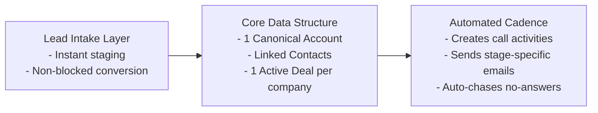
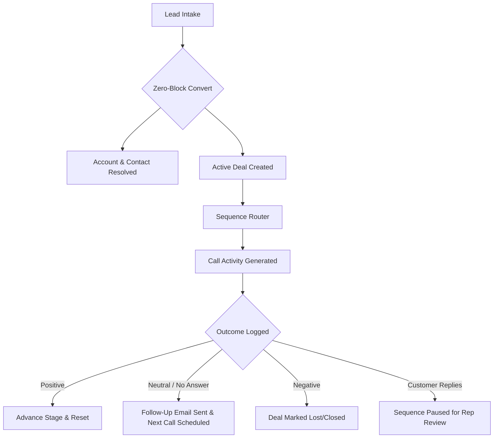

# Jurnii.io CRM Automation: Executive Overview

## TL;DR

Jurnii.io’s CRM has been modernized into a clean, automated commercial engine. The system moves away from treating isolated, single-use Lead records as permanent assets, shifting instead to a consolidated, durable data model: **Accounts, Contacts, and Deals**.

This architecture prevents duplicate customer accounts, automates Deal value calculations using real product prices, tracks multi-contact interactions, and implements an automated call-and-email outreach cadence. The result is a highly clean and reliable pipeline that ensures no prospect is forgotten and forecasts are accurate.

---

## What This Covers

This document serves as the high-level roadmap for the Jurnii.io commercial leadership walkthrough. It covers:
*   **The Business Vision**: Why shifting our operational focus from short-term "Leads" to permanent Accounts, Contacts, and Deals is critical to Jurnii.io's growth.
*   **Commercial & Product Value**: How the system resolves data duplication, missed manual follow-ups, and unreliable pipeline reporting.
*   **The Simplified Customer Journey**: A high-level visual flowchart illustrating how a prospect flows through our intake and sales cadence.
*   **The Architecture**: The high-level data models and components that enforce these system invariants.

---

## The Commercial Problem Solved

Traditional CRM systems fail due to "data rot"—duplicate records, isolated communication history, and guessed deal valuations. This creates four major commercial problems:
1.  **Duplicate Outreach**: If two reps speak to different contacts at the same prospect company, they often create separate accounts, leading to disjointed communication and a poor brand experience.
2.  **Unreliable Forecasts**: Reps frequently guess deal values or create separate deals for every product interest, inflating the sales pipeline with duplicate opportunities.
3.  **Dropped Opportunities**: Without rigid guardrails, reps fail to follow up consistently after a prospect goes cold or misses a demo booking.
4.  **Data Silos in Leads**: Storing long-term prospects in the "Leads" module isolates valuable demographic and product-interest data.

---

## The Solution: A Durable Operating Model

Our new automation addresses these exact failures by implementing a strict database lifecycle model:

### Leads are Staging Records, Not Commercial Objects
Leads are no longer the permanent home for prospect data. They function strictly as an **intake and staging area**. Every incoming Lead is immediately converted into a Contact, Account, and Deal. Crucially, missing enrichment data (like phone or website) **never blocks conversion**—the system prioritizes clean data structure over rigid gatekeepers.
*   *Evidence*: `v4/processLead.deluge`

### The Real Operating Model: Accounts, Contacts, Deals & Products
Once converted, the commercial relationship is tracked across four durable modules:
*   **Accounts**: Represent the company (the absolute commercial boundary). There is only ever **one canonical Account** per real company.
*   **Contacts**: Represent the individuals at that company. All contacts are linked to the canonical Account.
*   **Deals**: Represent the commercial motion. There is only ever **one active Deal** per Account.
*   **Products**: Represent the solutions. Product interests are resolved against our live catalog to calculate the Deal's value automatically.
*   *Evidence*: `spec.md`, `v4/processContact.deluge`, `v4/processAccount.deluge`, `v4/processDeal.deluge`

---

## High-Level Customer Journey

This simple diagram shows how a prospect record enters Jurnii.io's system, instantly converts, and enters our automated sales machine:

---

## Measurable Business Outcomes

*   **Zero Duplicate Outreach**: Our domain-based identity resolution guarantees that all contacts at the same company land in the same Account, under a single active Deal.
*   **Automated Forecasting**: Deal valuations are derived directly from the active products attached to the Deal, eliminating human guesswork.
*   **Complete Pipeline Coverage**: The state machine automates follow-up cadences, ensuring cold prospects are systematically nurtured or chased through a 7-step sequence before deactivation.
*   **Safety Intercepts**: If a prospect replies to an automated email, the system instantly pauses the cadence, protecting the relationship from tone-deaf, automated follow-ups.
