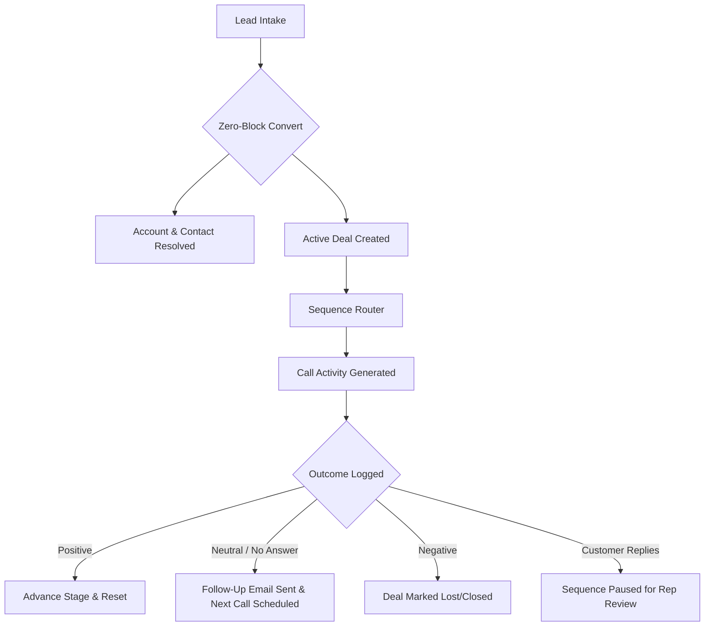

# Jurnii.io CRM Automation: Executive Overview

## TL;DR

Built Jurnii.io's Zoho CRM automation system from the ground up. This system shifts our operational model away from messy, single-use Lead records to a consolidated, durable, and automated data engine: **Accounts, Contacts, and Deals**. 

Instead of reps chasing duplicate records or losing track of follow-ups, the CRM now acts as an automated state machine. It prevents duplicate accounts, matches products to real pricing to automate deal values, coordinates multi-contact communications, and drives a highly organized call-and-email cadence that ensures no deal is ever dropped.

---

## What This Covers

This document serves as the high-level roadmap for the CEO walkthrough of the new Jurnii.io commercial operating model. It covers:
*   **The Business Vision**: Why shifting our operational focus from short-term "Leads" to permanent Accounts, Contacts, and Deals is critical to Jurnii.io's growth.
*   **Commercial & Product Value**: The real-world business outcomes this system delivers—eradicating duplicate outreach, generating authentic pipeline forecasts, and lifting close rates.
*   **Customer Journey Mapping**: A high-level visual flowchart illustrating how a prospect flows seamlessly from intake through our automated sales sequence.
*   **The Four Pillars of the Architecture**: The architectural foundation stones that govern data staging, domain-based identity resolution, stage rollups, and product-derived values.
*   **Project Readiness Status**: An executive scorecard showing what is complete, what is currently partial, and our clear action plan for launch.

---

## Why It Matters: Commercial & Product Value

In a standard sales environment, CRM systems degrade because of "data rot"—duplicate records, misaligned contacts, and incomplete details. This system fixes those exact failures to drive three core business outcomes:

### 1. Eliminating Duplicate Accounts (Data Hygiene)
Historically, if a lead entered the system from a different email address or with a slightly different company name, Zoho would create a duplicate account. Our reps would work in isolation, unaware that colleagues were speaking to the same prospect. 
*   **The Fix**: A robust 4-level lookup tree searches for existing accounts using domains, websites, and clean company names *before* anything is created.
*   **Business Value**: Keeps our prospect communication professional and unified, preventing embarrassing double-outreach.

### 2. The "One Active Deal" Rule (Clear Forecasts)
Reps often create multiple deals per contact or per product interest, making the sales pipeline look artificially inflated and impossible to forecast.
*   **The Fix**: A company has exactly **one active Deal** representing their current buying motion. If a second active deal is accidentally created, the system immediately silences and flags it as a duplicate.
*   **Business Value**: A highly accurate, clean, and realistic sales forecast that the CEO can rely on for investor reporting.

### 3. Automated Cadence (Higher Close Rates)
Sales reps are busy; they forget to follow up, send the wrong email template, or fail to log calls.
*   **The Fix**: Every deal is enrolled in a rigid, automated cadence. The system creates a Call activity for the rep. If the call isn't positive, the system immediately sends a tailored follow-up email and schedules the next call. If they fail to answer after 5 calls, it executes a 7-step email "chase" sequence before gracefully pausing.
*   **Business Value**: Complete coverage of our pipeline. Every prospect is touched at the exact right interval, leading to higher conversion rates without manual admin work.

---

## High-Level Visual Mapping

This diagram illustrates how a Lead enters our system, converts instantly, and flows into our automated commercial machine:



---

## What Has Been Built (The Architecture)

Our Zoho CRM is structured around **four core pillars** that govern how customer data is processed:

```text
       Lead Intake Layer                  Core Data Structure                 Automated Activity Cadence
┌──────────────────────────────┐       ┌───────────────────────────────┐       ┌────────────────────────────────┐
│   Leads = Staging Area Only  │ ───►  │  1 Canonical Account / Comp   │ ───►  │ Creates call-activity tasks    │
│  - Instant, non-blocked      │       │  - Linked to Contacts         │       │ Sends stage-specific templates │
│    conversion to Contact/Acc │       │  - 1 Active Deal per company  │       │ Auto-chases no-answers (7 step)│
└──────────────────────────────┘       └───────────────────────────────┘       └────────────────────────────────┘
```

1.  **Lead-as-Staging Model**: Leads are no longer permanent records. They act strictly as a staging/intake area. They are processed instantly into durable Contacts, Accounts, and Deals. Missing details (like a phone number or exact address) never block this conversion.
2.  **Account Identity Resolution**: When a record is processed, the system extracts the website domain and email domain to establish a unique `Account_Key` (e.g., `companydomain.com`). This key resolves duplicates with absolute precision.
3.  **Furthest Contact Progression**: A single Deal is connected to multiple Contacts at an Account. The system scans all open Contacts under that Account and automatically advances the Deal's stage to match the **furthest open Contact** (e.g., if one Contact is booking a demo but another has attended, the Deal is set to `Demo Attended`).
4.  **Product-Derived Valuations**: Instead of reps manually guessing Deal values, the system aggregates the product interests across all contacts, resolves them against our real Zoho Product catalog, sums their prices, and automatically updates the `Deal.Amount`.

---

## Current System Status

Below is the status of the entire CRM suite based on a thorough review of the code and configuration templates:

| Component | Status | Code Evidence | Notes |
| :--- | :---: | :--- | :--- |
| **Lead Processor Pipeline** | **Complete** | [`processLead.deluge`](file:///C:/Development/Projects/zoho-functions/v4/processLead.deluge) | Converts Lead, stamps role, silences duplicate deals, rolls up stages. |
| **Contact Reconciler** | **Complete** | [`processContact.deluge`](file:///C:/Development/Projects/zoho-functions/v4/processContact.deluge) | Restructures Contact under canonical Account, updates Deal stage rank. |
| **Account Aggregator** | **Complete** | [`processAccount.deluge`](file:///C:/Development/Projects/zoho-functions/v4/processAccount.deluge) | Creates Deals when missing, recalculates multi-contact furthest stages. |
| **Deal Integrity Watch** | **Complete** | [`processDeal.deluge`](file:///C:/Development/Projects/zoho-functions/v4/processDeal.deluge) | Silences duplicate active deals, manages primary contact selection. |
| **Sequence Router** | **Complete** | [`sequenceRouter.deluge`](file:///C:/Development/Projects/zoho-functions/v4/activity/sequenceRouter.deluge) | Directs bootstrapping, resumes after pauses, manages 7-email chase chain. |
| **Call Outcome Gate** | **Complete** | [`handleCallOutcome.deluge`](file:///C:/Development/Projects/zoho-functions/v4/activity/handleCallOutcome.deluge) | Executes outcome-driven state transitions (Positive, Neutral, DNC, etc.). |
| **Email Event Handler** | **Complete** | [`handleEmailEvent.deluge`](file:///C:/Development/Projects/zoho-functions/v4/activity/handleEmailEvent.deluge) | Intercepts replies and bounces to pause sequences and trigger repair tasks. |
| **Email Templates** | **Partial** | [`TEMPLATE_NAMING_MATRIX.md`](file:///c:/Development/Projects/zoho-functions/.agents/context/activity-workflows/TEMPLATE_NAMING_MATRIX.md) | Structured naming convention and design is finalized; templates require copy. |
| **UI Workflow Rules** | **Ready for Enablement** | [`WORKFLOW_TRIGGER_MAP.md`](file:///c:/Development/Projects/zoho-functions/.agents/context/activity-workflows/WORKFLOW_TRIGGER_MAP.md) | Standard Zoho CRM triggers are mapped to invoke our published scripts. |

---

## Next Steps for the CEO & Commercial Leadership

To complete this rollout, the following business decisions and simple configuration steps are recommended:
1.  **Review the Commercial Mappings**: Ensure the 8 Stages (Marketing Consent to Renewal) and 4 Opportunities (MQL to RTP) match your sales team's vocabulary.
2.  **Approve Email Template Copy**: Review the email copy templates for the automated cadences so they sound authentic to the Jurnii.io brand.
3.  **UI Switch-On Plan**: Authorize the sequential activation of the 10 Zoho Workflow Rules to begin driving the state machine.
