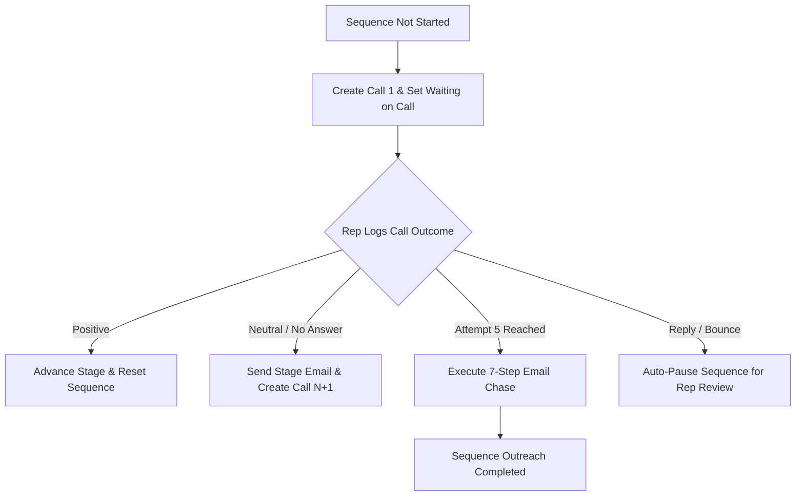

# Jurnii.io CRM: Email, Call, and Activity Workflows

## TL;DR

This document details Jurnii.io's automated outreach state machine. It maps how calls, emails, and meetings are orchestrated, how human call outcomes drive email cadences, how the system intercepts customer replies to pause automation, and outlines our current project completeness, risks, and next steps.

---

## What This Covers

*   **The Sequence Router State Machine**: How deals progress through call-and-email cadences.
*   **The Call-Outcome Gate**: The human checkpoint that decides what email is sent next.
*   **The Post-Call Email Cadence**: The 7-email chase sequence that fires after Call 5.
*   **Reply & Bounce Interception**: How the system listens for email responses to halt automation.
*   **Completeness Audit, Risks, & Next Steps**: What is built, where structural risks lie, and the setup checklist.

---

## The Sequence Router (State Machine)

Every open Deal is driven by an automated state machine managed by [`sequenceRouter.deluge`](file:///C:/Development/Projects/zoho-functions/v4/activity/sequenceRouter.deluge). The machine tracks progression via the `Sequence_Status` field:

*   **Suppression Gate**: If a Deal is marked `Automation_Suppressed = true` (e.g., an existing client or manual account), the sequence router exits immediately.
*   **Stage Change Resets**: If the Deal's stage (`Stage1`) changes, the router automatically calls [`supersedeOldSequence`](file:///C:/Development/Projects/zoho-functions/v4/activity/supersedeOldSequence.deluge) to cancel all pending call and email activities for the old stage, resets attempt counts, and bootstraps Call 1 for the new stage.

---

## The Call-Outcome Gate

Human calls are the primary checkpoints in the sales cycle. When a representative logs a call, they select a **Call Outcome** value in Zoho. The system immediately executes the corresponding rule:

| Call Outcome | System Action | What It Means for the Business |
| :--- | :--- | :--- |
| **Positive** | Advances Stage and Opportunity. Stops current cadence and bootstraps the new stage. | Prospect agreed to move forward (e.g., booked a demo, asked for commercials). |
| **Neutral** | Sends the current stage's follow-up email and generates the next Call attempt (Call N+1). | Conversation occurred but no firm next step was agreed. Keep prospecting. |
| **No Answer** | Sends the no-answer email template and generates the next Call attempt (Call N+1). | Prospect didn't pick up. Send a brief email and queue another dial task. |
| **Negative** | Closes Deal as **Lost**, sets status to **Closed**, and halts all sequence automation. | Prospect explicitly declined or was disqualified. |
| **Deferred** | Pauses sequence and stamps `Sequence_Paused_Until` with the chosen follow-up date. | Prospect is busy or asked to be chased in a month. Sequence resumes on that date. |
| **Bad Data** | Pauses sequence and creates an immediate **Data Repair Task** for the rep. | Invalid email, dead phone number, or wrong contact information. |
| **Already Handled** | Marks the step as complete; no email is sent, no new call is generated. | Rep handled this step manually outside of the standard flow. |
| **Not Relevant** | Pauses sequence and generates an internal **Manual Review Task** for the rep. | Odd scenario that doesn't fit standard outcomes. Needs eyes. |
| **Manual Only** | Disables automation entirely, setting `Automation_Suppressed = true`. | Deal requires highly customized, high-touch personal handling. |
| **Do Not Contact** | Disables automation and flags the Contact as a permanent suppression. | Legal or compliance request to be removed from outreach. |

---

## The Post-Call Email Cadence (7-Email Chase)

If a representative calls a prospect 5 times and receives only **Neutral** or **No Answer** outcomes, the system shifts into a pure email chase:
1.  `Sequence_Status` is updated to `Waiting on Email Trigger`.
2.  An automated email (`{Stage} Post-Call Email Chain 1`) is sent immediately.
3.  The system schedules `Next_Action_Due_Date` to fire exactly **3 calendar days** later.
4.  Every 3 days, the system automatically sends the next email in the chain (up to **7 emails total**).
5.  If Step 7 is reached without response, the sequence is marked `Completed` and gracefully deactivates.

### Reply & Bounce Interception
This automated chase is highly effective, but it is dangerous if a client replies and the system keeps sending automated emails.
*   **The Interception Hook**: When a prospect **Replies** to an outreach email, Zoho UI's Outgoing Email Replied trigger immediately fires and invokes [`handleEmailEvent.deluge`](file:///C:/Development/Projects/zoho-functions/v4/activity/handleEmailEvent.deluge).
*   **The Safe Halting**: The script instantly pauses the Deal sequence (`Sequence_Status = Paused`), schedules no further emails, and generates an internal **Review Reply Task** for the sales representative to read and respond manually.
*   **Bounces**: If an email **Bounces**, the script pauses the deal, creates a **Data Repair Task**, and flags the Contact's profile as `Needs Enrichment`.

---

## Project Status, Risks, and Technical Constraints

Based on a comprehensive review of Jurnii.io's repository files and the Zoho CRM API metadata, here is the current project status and operational risks:

### 1. Project Completeness Matrix

| Area | Status | Evidence | Notes |
| :--- | :---: | :--- | :--- |
| **Core Database Engines** | **100% Complete** | `v4/process*.deluge` | Deduplication, role mappings, and product summation are fully written. |
| **Sequence Router State Machine** | **100% Complete** | `activity/sequenceRouter.deluge` | Supports bootstrap, supersede, pauses, and email chains. |
| **Call Outcome Gate** | **100% Complete** | `activity/handleCallOutcome.deluge` | Maps all 10 outcome branches correctly. |
| **Email Event Interception** | **100% Complete** | `activity/handleEmailEvent.deluge` | Captures replies and bounces to pause cadences. |
| **Email Templates** | **50% Partial** | `activity/_util_resolveTemplate.deluge` | Naming convention and lookup matrix are code-complete. Text copy must be created in Zoho UI. |
| **UI Workflow Configuration** | **Ready for Setup** | `WORKFLOW_CONFIGURATION_CHECKLIST.md` | Clear steps to map Zoho workflow rules to Deluge scripts. |

### 2. Discovered Zoho Technical Constraints (Important for the CEO)

During implementation, three hard platform limitations in Zoho CRM were discovered and successfully bypassed:
*   **Activities Module Disallows Custom Lookups**: Zoho CRM does not support standard "Lookup" fields on the Calls, Events, or Tasks modules. 
    *   *Our Solution*: The system uses Zoho's built-in polymorphic `What_Id` lookup and stamps `$se_module = "Deals"` to link call activities to Deals.
*   **Activities Module Disallows Checkboxes**: Zoho CRM does not support true Boolean (true/false checkbox) fields on Activities.
    *   *Our Solution*: Fields like `Sequence_Managed` and `Stale` were created as **Picklist** fields with values `Yes` and `No`. The code was adjusted to read `"Yes"` strings rather than `true` booleans.
*   **Activities Custom Fields are Shared**: Any custom field created on the `Calls` module automatically appears on the `Events` and `Tasks` modules. Creating them a second time returns a `DUPLICATE_DATA` error.
    *   *Our Solution*: We designed a consolidated shared activities schema to prevent conflicts.

---

## Actionable Next Steps

To successfully go live with this new system, follow this prioritized execution plan:

### Step 1: Create Email Templates in Zoho UI
Open the Jurnii.io Zoho CRM setup and create the email templates exactly matching the naming convention defined in [`TEMPLATE_NAMING_MATRIX.md`](file:///c:/Development/Projects/zoho-functions/.agents/context/activity-workflows/TEMPLATE_NAMING_MATRIX.md).
*   *Naming format*: `{Stage1} Email {Attempt}` (e.g., `Demo Booking Email 1`) and `{Stage1} Post-Call Email Chain {Step}` (e.g., `Demo Booking Post-Call Email Chain 1`).
*   *Special templates*: Create the 7 system templates (e.g., `Demo Booked Confirmation Email`, `Commercials Sent Terms Email`).

### Step 2: Establish the connection
Go to Setup → Developer Space → Connections and configure a connection named **`zoho_crm`** with these exact scopes:
*   `ZohoCRM.modules.contacts.UPDATE`
*   `ZohoCRM.modules.contacts.READ`
*   `ZohoCRM.modules.contacts.send_mail`
*   *Why*: This allows our script to invoke the native Zoho Send Mail API and send emails on behalf of our sales representatives.

### Step 3: Configure UI Workflow Rules
Follow the step-by-step instructions in [`WORKFLOW_CONFIGURATION_CHECKLIST.md`](file:///c:/Development/Projects/zoho-functions/.agents/context/activity-workflows/WORKFLOW_CONFIGURATION_CHECKLIST.md) to set up the 10 workflow rules in the Zoho UI. Activate them in this order:
1.  **WF001**: Lead Processor
2.  **WF002 & WF003**: Deal Sequence Routers
3.  **WF006**: Call Outcome Handler
4.  **WF004 & WF005**: Commercial & Demo Outcome Handlers
5.  **WF009a-e**: Outgoing Email Events (Replied, Bounced, Clicked)
6.  **WF010**: Date-Based Follow-Up Router

### Step 4: Backfill & Safe Transition
Before toggling the workflow rules on:
1.  Set `Sequence_Status = Not Started` on all existing active Deals that you want to enroll in the new cadences.
2.  Explicitly set `Automation_Suppressed = true` on any current deals that should remain entirely manual.
