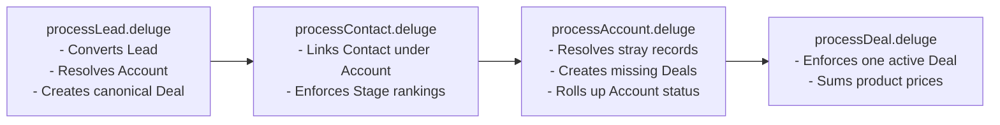

# Jurnii.io CRM: System and Database Breakdown

## TL;DR

Jurnii.io’s CRM database relies on automated reconcilers that run every time a record is created or updated. These reconcilers act as "database police," automatically correcting inconsistencies, merging duplicates, calculating deal valuations from live product prices, and ensuring that our data always converges to a single canonical source of truth.

---

## What This Covers

This document outlines the technical architecture of Jurnii.io's CRM system in business-readable terms. It covers:
*   **The Reconciler Pipeline**: How the system processes data behind the scenes.
*   **The CRM Invariants**: The absolute rules that govern our customer database.
*   **The Database Convergence Model**: How our data structures align after every database transaction.
*   **Cascade Loop Protection**: How the CRM stops automated scripts from racing against each other.

---

## The Reconciler Pipeline

Our CRM does not rely on human memory to keep data accurate. Instead, four Deluge functions run automatically in the background to stage, link, and rollup data across our core objects:



*   **Lead Intake & Zero-Block Conversion** (`v4/processLead.deluge`): When a Lead is marked ready, the system immediately converts it. If essential enrichment fields are missing, **conversion is never blocked**—data-hygiene is resolved post-conversion.
*   **Contact Reconciler** (`v4/processContact.deluge`): Runs when a Contact is created/edited, ensuring the Contact belongs to the correct Account, linking them to the active Deal's roles, and updating stage rankings.
*   **Account Aggregator** (`v4/processAccount.deluge`): Scans all related Contacts and Deals under a company Account, resolving stray records, ensuring an active Deal exists, and rolling up account-level state.
*   **Deal Integrity Watch** (`v4/processDeal.deluge`): Actively monitors Deals to block duplicates, recalculate primary Contact fields, and trigger automated sales sequences.

---

## Core Invariant Database Rules

Every reconciler is written to enforce our core database rules, ensuring our CRM never degrades:

### 1. The "One Canonical Account" Rule
To prevent duplicate accounts, the system resolves company identities using a strict **4-stage lookup tree**:
1.  **Unique Account_Key**: Matches a derived key (e.g. `company.com` extracted from Website or Email domain).
2.  **Website Domain**: Matches the website URL (case and protocol tolerant).
3.  **Normalized Company Name**: Matches the company name after stripping punctuation and whitespace (e.g. "Acme Corporation" matches "Acme Corp" alias mapping).
4.  **Auto-Creation Fallback**: Creates a new Account only if stages 1-3 fail.
*   *Evidence*: `spec.md` (lines 202–209), `v4/processLead.deluge` (lines 103–183)

### 2. The "One Active Deal" Rule (Duplicate Silencing)
Each Account has exactly **one active Deal** representing the overall commercial motion. If a second active Deal is created:
*   The system identifies the **oldest Deal** (by lowest ID) as canonical.
*   All other active Deals are permanently silenced: `State = Lost`, `Status = Closed`, `Reason_For_Loss__s = Duplicate / Test Record`, and `Deal_Key` is cleared.
*   *Evidence*: `spec.md` (lines 212–224, 269–286), `v4/processDeal.deluge` (lines 73–114)

### 3. The "Furthest Contact" Progression
A Deal’s pipeline stage comes from the furthest open Contact under the Account.
*   If Contact A is in `Demo Booking` and Contact B is in `Demo Attended`, the Deal is automatically promoted to `Demo Attended`.
*   The furthest open Contact is designated as the **primary Contact** (`Contact_Name`) on the Deal.
*   **Lost Contacts Do Not Pull Deals Back**: A single "Lost" Contact never pulls a Deal backward as long as other open Contacts exist under the Account. The Deal only closes as `Lost` when **all** related Contacts are Lost.
*   *Evidence*: `spec.md` (lines 226–266), `v4/processAccount.deluge` (lines 496–544)

### 4. Automated Contact Roles (`Contact_Roles` related list)
Every Contact under an Account is automatically attached to the Deal’s `Contact_Roles` list.
*   Roles are derived from their `Job_Title` field using a Jurnii Persona mapping.
*   **Precedence Tree**: If a title maps to multiple roles, the senior role wins: **Decision Maker** > **End User** > **Influencer**.
*   **Manual Overwrite Protection**: The system **never** overwrites a role that a representative has manually adjusted in the Zoho UI.
*   *Evidence*: `spec.md` (lines 288–301), `v4/processContact.deluge` (lines 441–547)

### 5. Product-Derived Deal Value
Prospect product interest is captured in plain text during intake. The system:
1.  Calculates the **union** of product interests across the Lead, all Contacts, and the existing Deal.
2.  Resolves them against our active **Zoho Products Module** catalog.
3.  Attaches them to the Deal's Products related list.
4.  **Sums their Unit Prices** and automatically stamps the total into `Deal.Amount`.
5.  *Cascade Protection*: When recalculating, existing line-item prices are summed first, preventing accidental $0 rewrites on mid-stage updates.
*   *Evidence*: `spec.md` (lines 304–323), `v4/processLead.deluge` (lines 725–845)

---

## The Database Convergence Model

After any Lead, Contact, Account, or Deal transaction is processed, the CRM is forced to converge to this exact state:

| Component | Target Convergence State | Enforced By |
| :--- | :--- | :--- |
| **Accounts** | Exactly **one canonical Account** exists per real company domain. | `v4/processLead.deluge` |
| **Contacts** | All related company Contacts are linked to the resolved Account. | `v4/processContact.deluge` |
| **Deals** | Exactly **one active Deal** exists for the Account; duplicate Deals are closed. | `v4/processDeal.deluge` |
| **Contact Roles** | Every Contact is linked to the Deal with a Job-Title mapped role; manual roles are preserved. | `v4/processAccount.deluge` |
| **Products** | Resolved Products are linked to the Deal’s Product related list. | `v4/processLead.deluge` |
| **Deal Stage & Value** | `Stage1`, `Stage`, `State`, `Status`, primary Contact, and `Amount` are updated and accurate. | `v4/processDeal.deluge` |
| **Account Rollup** | Account `State` and `Status` are rolled up based on active Deals. | `v4/processAccount.deluge` |

*   *Evidence*: `spec.md` (lines 325–339)

---

## Cascade Loop Protection (The Suppression Map)

Because our core modules are tightly integrated, updating a record in one module can trigger a workflow that updates another module, creating an infinite processing loop.

*   **The Solution (Trigger Gating)**: When our Deluge scripts perform background database updates, they pass an empty **`trigger` map** to Zoho's update API:
    ```deluge
    suppressTrigger = Map();
    suppressTrigger.put("trigger", List());
    zoho.crm.updateRecord("Deals", dealId, dUpd, suppressTrigger);
    ```
*   **Operational Behavior**: This updates the database fields instantly, but instructs Zoho **not** to fire any workflow rules on that change, preventing infinite loops.
*   **Where Workflows ARE Allowed to Fire**:
    *   When `handleCallOutcome` registers a **Positive** call, it updates `Stage1` *without* suppression. This intentionally trips `WF003` (Stage Change) so the `sequenceRouter` bootstraps the next stage's call activities.
*   *Evidence*: `v4/activity/handleCallOutcome.deluge` (lines 118–121)
