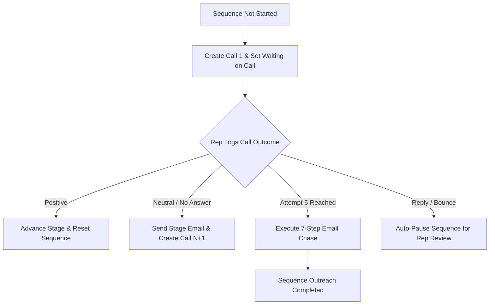

# Jurnii.io CRM: Activity Cadences and Workflow Rules

## TL;DR
> [!NOTE]
> This document describes the legacy **v1 Call-First** cadence. As of **v5**, the system uses a **Task-Gated Sequence Routing** state machine (with support for Call First, Email First, Meeting First, Task First, and Manual Review First sequences).
> 
> Jurnii.io operates a call-gated sales cadence that ensures structured follow-ups. Standard Zoho UI Workflow Rules act as the "trigger layer," detecting changes and invoking Deluge functions (the "logic layer") to manage prospect sequences. From a prospect’s first call to automated 7-step email chases and reply interceptions, every interaction is governed by strict rules mapped to our commercial stages.

---

## What This Covers

This document outlines the workflow and activity layer for commercial leadership. It covers:
*   **Trigger Layer vs. Logic Layer**: The distinction between Zoho UI Workflow Rules and Deluge scripts.
*   **The Workflow Inventory**: The full catalog of workflows driving our CRM automation.
*   **The Cadence State Machine**: How prospect outreach sequences operate and handle outcomes.
*   **Commercial Field Gating**: How stage, opportunity, state, and status flow through our sequences.

---

## Trigger Layer vs. Logic Layer

To maintain architectural stability, Jurnii.io separates CRM execution into two layers:

| Layer | System Component | What It Does |
| :--- | :--- | :--- |
| **Trigger Layer** | **Zoho UI Workflow Rules** | Monitor database actions (e.g. "On Record Create," "Field Update") and decide **when** an automation should fire. They do not contain commercial logic. |
| **Logic Layer** | **Deluge Backend Functions** | Programmatic scripts that execute under the `automation` namespace. They run calculations, query related records, and decide **what** actually happens. |

*   *Evidence*: `.agents/context/activity-workflows/WORKFLOW_TRIGGER_MAP.md`

---

## The Core Workflow Inventory

Ten core workflow rules connect Zoho CRM events to our Deluge logic layer:

| Workflow | Module | Trigger Event | Published Function | Business Purpose |
| :--- | :--- | :--- | :--- | :--- |
| **WF001** | `Leads` | Created or Edited (Ready for Convert) | `processLead` | Converted Lead, stages Contact + Account + Deal, and initializes Deal sequence. |
| **WF002** | `Deals` | Created or Edited (`Sequence_Status = Not Started`) | `sequenceRouter` | Bootstraps the active sequence and generates `Call 1` for the current stage. |
| **WF003** | `Deals` | Field Update (`Stage1` changed) | `sequenceRouter` | Supersedes active sequences, cancels stale tasks, and bootstraps the new stage. |
| **WF004** | `Deals` | Field Update (`Commercials_Status` changed) | `handleCommercialsStatusChange` | Detects when commercials are `Sent` to advance the stage to `Commercial Agreement` (FTP). |
| **WF005** | `Deals` | Field Update (`Demo_Outcome` changed) | `handleDemoOutcome` | Processes demo results (e.g., `Attended - Qualified` advances stage to `Proposal Preparation`). |
| **WF006** | `Calls` | Created or Edited (Managed Call Outcome logged) | `handleCallOutcome` | Evaluates rep call results to trigger emails, queue next calls, or advance stages. |
| **WF007** | `Events` | Created or Edited (Managed Meeting) | `handleMeetingEvent` | Calculates calendar events, sets reminder dates, and updates demo statuses. |
| **WF008** | `Tasks` | Field Update (`Status = Completed` or Outcome set) | `handleTaskCompletion` | Evaluates completed enrichment, data repair, or proposal tasks to resume sequences. |
| **WF009a-e** | `Emails` | Outgoing Email events (Replied, Bounced, etc.) | `handleEmailEvent` | Intercepts communication changes to pause automation and create review tasks. |
| **WF010** | `Deals` | Date-Time Field Reached (Scheduler) | `sequenceRouter` | Resumes paused sequences or fires the next automated email in a chase chain. |

*   *Evidence*: `.agents/context/activity-workflows/WORKFLOW_TRIGGER_MAP.md`, `v4/activity/sequenceRouter.deluge`

---

## The Cadence Lifecycle

Jurnii.io operates a structured sequence flow designed to support reps and automate follow-ups:

### 1. Every Stage Starts with a Call
When a sequence is initialized, the system creates a **Call Activity** for the sales representative. The sequence status is updated to `Waiting on Call`. The automated sequence will not proceed until a human logs the call outcome.
*   *Evidence*: `v4/activity/sequenceRouter.deluge` (lines 129–149)

### 2. The Call-Outcome Gate
When the rep logs a call, their **Call Outcome** selection dictates the next system action:
*   **Positive Outcome**: The sequence advances the Deal stage (e.g., `Demo Booking` to `Demo Confirmation`). This trips `WF003` to reset attempt counts and bootstrap Call 1 for the new stage.
*   **Neutral / No Answer**: The system automatically triggers the stage-specific email template (e.g., `Demo Booking Email 1`) and creates the next Call Task (Call N+1), setting `Active_Sequence_Attempt = N+1`.
*   **Negative Outcome**: Halts all automation. Updates Deal to `State = Lost` and `Status = Closed`.
*   **Deferred**: Pauses the sequence until the specified `Next_Follow_Up_Date`.
*   **Manual Only / Do Not Contact**: Flags the Deal as suppressed and disables automation.
*   *Evidence*: `v4/activity/handleCallOutcome.deluge`

### 3. The 7-Email Chase Chain
If the representative completes 5 call attempts with only **Neutral** or **No Answer** outcomes, the system shifts to automated outreach:
*   `Sequence_Status` is set to `Waiting on Email Trigger`.
*   The system sends `{Stage} Post-Call Email Chain 1` immediately.
*   `WF010` is scheduled to fire every **3 calendar days**, advancing the `Active_Email_Chain_Step` and sending the next email (up to 7 steps) before marking the sequence `Completed` and deactivating.
*   *Evidence*: `v4/activity/handleCallOutcome.deluge` (lines 148–159), `v4/activity/sequenceRouter.deluge` (lines 99–127)

### 4. Communication Intercepts
Our emails contain automatic hooks to protect prospect relations:
*   **Replies**: If a prospect replies, `WF009a` intercepts it. `handleEmailEvent.deluge` pauses the sequence (`Sequence_Status = Paused`), stops future automated emails, and creates a **Review Reply Task** for the rep.
*   **Bounces**: If an email bounces, the sequence is paused and a **Data Repair Task** is generated.
*   *Evidence*: `v4/activity/handleEmailEvent.deluge`

---

## How Commercial Fields Flow into Workflows

Our commercial ontology is tightly bound to sequence routing:
1.  **Stage (`Stage1`) Drives Routing**: When `Stage1` changes, `WF003` executes `sequenceRouter`. This runs [`supersedeOldSequence`](file:///C:/Development/Projects/zoho-functions/v4/activity/supersedeOldSequence.deluge) to cancel pending calls, set `Sequence_Status = Waiting on Call`, and generate Call 1.
2.  **Opportunity (`Stage`) Defines Content**: The `Stage1` value determines which stage-specific template name is resolved by `_util_resolveTemplate.deluge` (e.g., `Demo Booking Email 1`).
3.  **State (`State`) Controls Gates**: If `State` is updated to `Lost` (via manual edit or negative call outcome), the active sequence deactivates, status is set to `Closed`, and all automation is halted.
