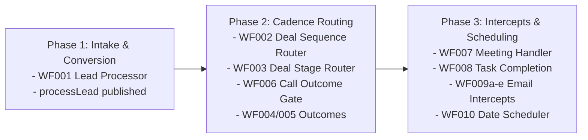

# Jurnii.io CRM: Leadership Rollout and Decision Checklist

## TL;DR

This document serves as the operational launch plan for Jurnii.io's commercial leadership. It outlines the core business decisions requiring approval, the required email template copy, a safe rollout sequence, and the backfill plan to migrate our existing pipeline data safely without disrupting active deals.

---

## What This Covers

*   **Commercial Decisions**: Mappings and boundaries requiring executive approval.
*   **Template Deliverables Checklist**: The specific email copies that need to be generated.
*   **Safe Launch Sequence**: The step-by-step order to activate the CRM automation.
*   **Data Backfill & Transition Plan**: Migrating our active pipeline without causing automated loops.
*   **Operational Risks & Technical Constraints**: System realities leadership must understand.

---

## Required Commercial Decisions

Before we turn on automation, leadership must align on the following three operational rules:

1.  **Stage Mapping Approval**: Confirm that the 8 stages (`Stage1`) and 4 opportunities (`Stage`) perfectly match our sales lifecycle. Pay special attention to the transition of the FTP (First-Time Purchase) progression stages.
2.  **Job Title Mappings**: Confirm the job-title-to-role mappings defined in the persona CSV. This determines which prospects are automatically designated as **Decision Makers**, **End Users**, and **Influencers** on our Deals.
    *   *Reference*: `field_mapping/Jurnii Personas - Job Tile to Contact Role Mapping.csv`
3.  **Suppression Gating Criteria**: Approve the suppression reasons (e.g., existing client, partner-managed) that allow a representative to permanently disable automation on a Deal by checking the `Automation_Suppressed` flag.
    *   *Reference*: `spec.md` (lines 188–198)

---

## Email Template Copy Deliverables

The code namespaces and automations look up templates dynamically based on a strict naming convention. Leadership must review, draft, and approve the actual text copy for these templates in Zoho:

### 1. Special Trigger Templates

| Template Name | Staging Trigger | Required Copy Purpose |
| :--- | :--- | :--- |
| **Demo Confirmation Email** | Demo Booking Call Positive / Event Created | Confirms demo calendar booking, time, and agenda. |
| **Demo Confirmation Reminder Email** | 1 Business Day before Demo | Protects meeting attendance (sent automatically). |
| **Demo Confirmation No-Show Email** | Demo Outcome set to `No Show` | Chases and recovers a prospect who missed their demo. |
| **Demo Hosted Post-Demo Email** | Demo Outcome set to `Attended - Qualified` | Thanks prospect, outlines next steps, and requests proposal data. |
| **Commercial Agreement Terms Email** | Commercials Status set to `Sent` | Transmits formal contract proposal and terms. |
| **Commercial Agreement Confirmation Email**| Commercials Status set to `Signed` | Confirms contract signature, outlines handoff. |
| **Onboarding Kickoff Email** | Onboarding Call 1 initialized | Welcomes client and provides kickoff setup steps. |

### 2. Stage-Specific Cadence Templates
Each of the following stages requires **5 Call follow-up email templates** and **7 post-call chase email templates** (created in Zoho under the exact format `{Stage1} Email {Attempt}` and `{Stage1} Post-Call Email Chain {Step}`):
*   `Marketing Qualification` (e.g. `Marketing Qualification Email 1` to `5`, and `Marketing Qualification Post-Call Email Chain 1` to `7`)
*   `Demo Booking`
*   `Demo Confirmation`
*   `Demo Hosted`
*   `Commercial Agreement`
*   `Onboarding`
*   `Renewal`
*   *Reference*: `activity-workflows/TEMPLATE_NAMING_MATRIX.md`

---

## Safe Launch Sequence

To prevent duplicate actions, race conditions, or infinite loops, the CRM workflows must be activated sequentially. Follow this order:

1.  **Verify Fields & Connection**: Ensure all custom activity picklists (Yes/No fields) are created and the `zoho_crm` integration connection is active.
2.  **Enable Phase 1 (Intake)**: Turn on `WF001` (Lead Processor). This ensures all new leads immediately convert into clean, consolidated Accounts/Deals without entering automated cadences.
3.  **Enable Phase 2 (Human Call Gates)**: Turn on `WF002`, `WF003`, `WF006`, and the outcome handlers (`WF004`, `WF005`). This enables reps to drive deals through stage transitions manually and create sequential call activities.
4.  **Enable Phase 3 (Outreach & Scheduling)**: Turn on `WF007`, `WF008`, the date scheduler `WF010`, and the email reply/bounce intercepts (`WF009a-e`). This fully automates email chaser sequences and protects relationships when clients reply.
    *   *Reference*: `activity-workflows/WORKFLOW_CONFIGURATION_CHECKLIST.md`

---

## Data Backfill and Transition Plan

To safely migrate our existing CRM pipeline to this new model without accidentally launching hundreds of automated emails to current prospects, follow this migration path:

1.  **Audit Active Deals**: Export a list of all Deals currently in an `Open` state.
2.  **Set Suppression Checkbox**: For any Deal currently being worked manually that should **not** enter automated sequences, set `Automation_Suppressed = true` immediately.
3.  **Enforce Initial States**: For the deals that *should* enter the new cadence, update their status fields:
    *   Set `Sequence_Status = Not Started`.
    *   Set `Active_Sequence_Stage` to match their current `Stage1`.
    *   Set `Active_Sequence_Attempt = 1`.
4.  **Publish Reconcilers**: Trigger a mass-update (re-save) on active Deals. This runs our consolidator scripts to recalculate primary contacts, roll up product valuations, and establish database integrity.

---

## Operational Risks and System Gaps

Commercial leadership must understand these CRM architecture realities:

*   **Connection Dependency**: The automated email engine relies on a custom connection named **`zoho_crm`** inside our Zoho CRM Developer Space. If this connection is deactivated or its permissions expire, automated emails will fail to send.
    *   *Required Scopes*: `ZohoCRM.modules.contacts.UPDATE`, `ZohoCRM.modules.contacts.READ`, `ZohoCRM.modules.contacts.send_mail`
*   **Zoho UI Email Rule Constraints**: Zoho CRM's API does not support configuring outgoing email event rules (`WF009a-e`). These **must be configured manually in the Zoho UI** following the exact guidelines in our setup checklist.
*   **Activity Module Picklist Rule**: Because Zoho CRM prevents true true/false checkboxes on Activities (Calls, Tasks, Events), fields like `Sequence_Managed` are Picklists set to `Yes` / `No`. Sales reps must not alter these values manually.
    *   *Reference*: `activity-workflows/FIELD_REUSE_NOTES.md` (lines 60–68)
