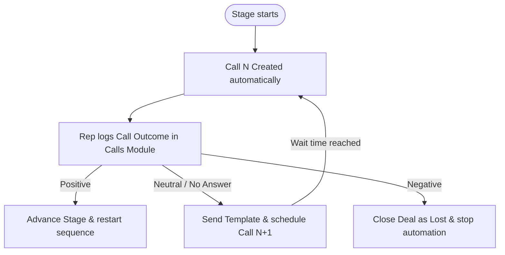

# 04 — Workflows and Cadences

## TLDR
The CRM automation separates timing from business logic:
*   **Zoho Workflow Rules** decide **when** something runs (Trigger layer).
*   **Deluge Functions** decide **what** actually happens (Logic layer).

---

## Core Workflow Trigger Inventory

Ten core Zoho workflow rules decide when our Published Deluge functions execute:

| Workflow | Module | Trigger Event | Published Function | Purpose |
| :--- | :--- | :--- | :--- | :--- |
| **WF001** | `Leads` | Lead marked ready | `processLead` | Convert Lead when marked ready |
| **WF002** | `Deals` | Sequence not started | `sequenceRouter` | Create Call 1 and start sequence |
| **WF003** | `Deals` | Stage changed | `sequenceRouter` | Reset stage sequence; clear old calls |
| **WF004** | `Deals` | Commercial status changed | `handleCommercialsStatusChange` | Move to `Commercial Agreement` / `Onboarding` stage |
| **WF005** | `Deals` | Demo outcome changed | `handleDemoOutcome` | Move to `Proposal Preparation` / `Demo Hosted` or schedule No Show |
| **WF006** | `Calls` | Call outcome logged | `handleCallOutcome` | Decide next action based on outcome |
| **WF007** | `Events` | Meeting / Demo updated | `handleMeetingEvent` | Set demo reminder dates and status |
| **WF008** | `Tasks` | Task completed | `handleTaskCompletion` | Evaluate manual work and resume sequence |
| **WF009** | `Emails` | Email event detected | `handleEmailEvent` | Pause sequence or log event |
| **WF010** | `Deals` | Date / Time reached | `sequenceRouter` | Resume deferred action or fire next email |

---

## Lead Conversion Gates (WF001)

Leads do not convert automatically or immediately. They convert only when they are marked ready and pass these strict gates:
*   **Ready for Conversion** is checked (true)
*   **Lead Processing Status** is empty **OR** `Not Processed`
*   **Email** is not empty
*   **Automation Suppressed** is not checked (false)

Once these gates are passed, conversion runs without blocking. Missing enrichment fields will never block the conversion.

---

## The Sales Cadence Lifecycle

This path outlines how a prospect flows through a stage sequence:

Normal sequence attempts create records in the **Calls** module. Tasks are used only for repair, review, enrichment, onboarding setup, and other manual work.

---

## Call-Outcome Gate Rules

When a representative logs a call in the Calls module, their **Call Outcome** selection determines what happens next:

*   **Positive Outcome**: Advances Deal Stage and Opportunity. Stops current sequence and bootstraps Call 1 of the new Stage.
*   **Neutral Outcome**: Sends stage-specific email template and creates the next Call (Call N+1).
*   **No Answer**: Sends no-answer email template and creates the next Call (Call N+1).
*   **Negative Outcome**: Closes Deal as `Lost` and Status as `Closed`. Halts all automation.
*   **Deferred**: Pauses sequence until Follow-Up Date is reached.
*   **Bad Data**: Pauses sequence and creates a manual **Data Repair Task** for the rep.
*   **Already Handled**: Logs the step as handled. No email is sent and no next Call is created.
*   **Not Relevant**: Pauses sequence and creates a manual **Review Task** for the rep.
*   **Manual Only**: Pauses sequence and suppresses future automation.
*   **Do Not Contact**: Pauses sequence and suppresses future automation.
*   **After 5 Call Attempts**: The system enters a **7-email chase chain** (sends an automated email every 3 days).
*   **After 7 Chase Emails**: Sequence is marked **Completed** and the next action date is cleared.

---

## Email Event Handler (WF009)

WF009 handles five email events:
1.  **Replied**: Sequence is paused; a manual **Review Reply Task** is created.
2.  **Bounced**: Sequence is paused; a manual **Data Repair Task** is created.
3.  **Not Replied**: Logged only. No state change. The regular cadence continues separately.
4.  **Opened but not replied**: Logged for rep visibility.
5.  **Clicked**: Logged for rep visibility.

Replies and bounces pause the sequence. Other email events are logged for visibility unless future branching is added.

---

## Implementation reference

Relevant repo files and configurations:
- `.agents/context/activity-workflows/WORKFLOW_TRIGGER_MAP.md`
- `v4/activity/sequenceRouter.deluge`
- `v4/activity/handleCallOutcome.deluge`
- `v4/activity/handleEmailEvent.deluge`
- `v4/activity/handleEmailReplied.deluge`
- `v4/activity/handleEmailBounced.deluge`
