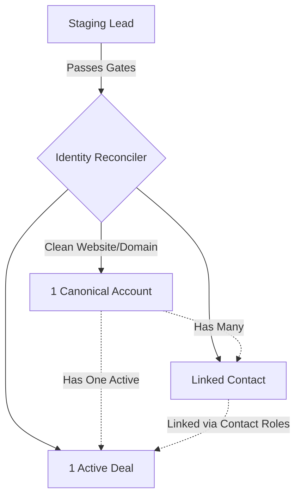

# 03 — How The Records Work

## TLDR
This document explains the Jurnii.io customer record model and how our background scripts automatically link and clean them.

---

## CRM Record Model

| Record | What it means | System rule |
| :--- | :--- | :--- |
| **Lead** | Messy intake record | Leads convert when they are marked ready for conversion; do not let data run from here. |
| **Account** | The company | One real company = one Account. This is our main boundary. |
| **Contact** | The person | Many Contacts can sit under one Account. |
| **Deal** | The buying motion | One active Deal per Account. |
| **Product** | What they want | Link actual Product catalog items to the Deal. |
| **Call** | Sales action | Normal sequence attempts create records in the `Calls` module. Call outcomes gate emails. |
| **Email** | Follow-up action | Sent automatically based on Call outcomes. |
| **Task** | Manual work | Tasks are used for repair, review, enrichment, onboarding setup, and other manual work. |
| **Event** | Meeting/demo | Used for demos and meetings. |

---

## The Core Goal

After our background reconciler runs, the CRM always corrects itself to have:
*   **One Account per real company**.
*   **Many Contacts** linked to that Account.
*   **One active Deal** representing the overall sales motion.
*   **Products linked** to the Deal’s related list.
*   **Contacts linked** to the Deal in `Contact_Roles`.
*   **Deal value** calculated from linked Product prices automatically.
*   **Account status** rolled up from active Deals automatically.

---

## Core Rules

### Canonical Account Lookup
The system uses domain, website, and cleaned company name to find the right Account before creating a new one. It uses this 4-step priority tree:
1.  **Unique Account Key** (derived website domain like `acme.com` or email domain).
2.  **Website** field exact matches.
3.  **Company Name** exact match (stripped of punctuation and symbols).
4.  **Create Account** fallback only if steps 1-3 find nothing.

### One Active Deal Rule
An Account should have one active Deal.

Do not create:
*   one Deal per Lead
*   one Deal per Contact
*   one Deal per Product

The Deal represents the current sales motion for the Account.

### Duplicate Deal Silencing
If multiple active Deals are found for the same Account:
*   The system keeps the oldest Deal as the canonical active Deal.
*   All other active Deals are immediately set to `State = Lost`, `Status = Closed`, marked `Duplicate / Test Record`, and their Deal Key is cleared.

### Contact Roles Mapped from Job Titles
All Contacts under the Account are linked to the Deal's `Contact_Roles` related list.
*   Roles are mapped from `Job_Title` (e.g. Director $\rightarrow$ Decision Maker).
*   **Seniority Wins**: Decision Maker > End User > Influencer.
*   **Manual Protection**: The system **never** overwrites a role set manually by a rep.

### Product Interest and Deal Amount
Reps enter product interests as text during intake. The system:
1.  Takes the **union** of products from the Lead, Contacts, and Deal.
2.  Resolves them against our live active Product catalog.
3.  Adds the Product to the Deal related list.
4.  **Sums their Unit Prices** and writes the total to `Deal.Amount` automatically.
5.  *Cascade Protection*: When recalculating, existing line-item prices are summed first, preventing accidental $0 rewrites on mid-stage updates.

### Furthest Open Contact Rule
A Deal's Stage comes from the furthest open Contact under the Account.
*   If Contact A is booking a demo but Contact B has attended, the Deal Stage is set to `Demo Attended`.
*   The furthest open Contact is set as the primary Contact on the Deal.

### Lost Contact Handling
A single "Lost" Contact does not pull the Deal backward or close it as long as another open Contact exists under the Account. The Deal only closes as `Lost` when **all** related Contacts are Lost.

---

## Implementation reference

Relevant repo files:
- `v4/processLead.deluge`
- `v4/processContact.deluge`
- `v4/processAccount.deluge`
- `v4/processDeal.deluge`
