# V6 Full Flow — Mermaid Code Chart & System Reference

> Generated from v6 source code (`v6/*.deluge` + `v6/activity/*.deluge`).
> **Source of truth**: actual v6 code. Drift from spec.md or v5 docs is explicitly noted.

---

## 1. Executive Summary

The **v6 automation system** is a **Contact-centric** CRM pipeline that converts Leads into a canonical `Contact → Account → Deal` graph and then orchestrates a multi-stage commercial lifecycle through automated sequences of Calls, Emails, Tasks, Meetings, and Quotes.

### Core Principles

1. **Zero-Block Always-Convert**: Every Lead is converted immediately. Validation and data quality only determine where the converted record lands in the ontology — never whether conversion happens.
2. **Contact-Centric Ownership**: The Contact owns its lifecycle state (`Sequence_State`, `Sequence_Type`, `Sequence_Stage`, `Sequence_Step`). The Deal is the aggregate rollup point; the Account is a thin aggregate of its Deals.
3. **Single Canonical Deal per Account**: One active Deal per Account, keyed by `Deal_Key = Account_Key + "::active"`. Duplicate Deals are silenced (marked Lost/Duplicate).
4. **Deterministic Call Chain**: `processLead → processContact → processDeal`. Each processor uses `suppressTrigger` to prevent workflow cascades.
5. **Task-Gated Activation**: Sequences are activated through a human-approved Sequence Activation Task. The rep chooses the route (Email, Call, Manual) via `Task_Sequence_Type`.
6. **Single Router**: `routeContactSequence` is the ONLY transition executor for Contact sequences. All handlers produce a token and delegate to it.
7. **Quote-to-Deal Ledger**: Quotes (standard Zoho module) seed at Proposal Preparation and drive the contract ledger via `syncConfirmedQuoteToDeal`. At most one Confirmed Quote per Deal.

### Ontology Verification (v6 Code vs. Expected)

| Expected Stage | v6 Code Stage | Match | Notes |
|---|---|---|---|
| Marketing Qualification | `Marketing Consent` | ⚠️ **DRIFT** | v6 uses `Marketing Consent` throughout, not `Marketing Qualification`. stageRanks key = `"Marketing Consent":1` |
| Demo Booking | `Demo Booking` | ✅ | |
| Demo Confirmation | `Demo Confirmation` | ✅ | |
| Demo Hosted | `Demo Hosted` | ✅ | |
| Proposal Preparation | `Proposal Preparation` | ✅ | |
| Commercial Agreement | `Commercial Agreement` | ✅ | |
| Onboarding | `Onboarding` | ✅ | |
| Renewal | `Renewal` | ✅ | |

| Expected Opp Type Mapping | v6 Code Mapping | Match |
|---|---|---|
| Marketing Qualification → MQL | Marketing Consent rank 1 → `bestOpp = "MQL"` | ✅ (functional equivalent) |
| Demo Booking → SQL | rank 2 → `bestOpp = "SQL"` | ✅ |
| Demo Confirmation → SQL | rank 3 → `bestOpp = "SQL"` | ✅ |
| Demo Hosted → SQL | rank 4 → `bestOpp = "SQL"` | ✅ |
| Proposal Preparation → FTP | rank 5 → `bestOpp = "FTP"` | ✅ |
| Commercial Agreement → FTP | rank 6 → `bestOpp = "FTP"` | ✅ |
| Onboarding → RTP | rank 7 → `bestOpp = "RTP"` | ✅ |
| Renewal → RTP | rank 8 → `bestOpp = "RTP"` | ✅ |

> [!IMPORTANT]
> **Key Drift**: The first stage is `Marketing Consent` in v6, not `Marketing Qualification` as in the expected ontology. The Deal completion-date field is named `Marketing_Qualification_Completed_At` (legacy name), but the stage value itself is `Marketing Consent`.

---

## 2. Entry Point Inventory

| Entry Function | Trigger / Caller | Primary Module | Purpose | Downstream Functions |
|---|---|---|---|---|
| `automation.processLead` | WF-Lead (Create/Edit) | Leads | Intake: read Lead, resolve Account, convert Lead, enrich Contact, create/resolve Deal, delegate to processContact | `processContact` |
| `automation.processContact` | WF-Contact (Create/Edit) or called by `processLead` | Contacts | Normalize Contact defaults, resolve/repair Account, resolve/create Deal, create Activation Task, delegate to processDeal | `processDeal` |
| `automation.processAccount` | WF-Account (Create/Edit) | Accounts | Ensure Account_Key, resolve canonical Deal, delegate to processDeal | `processDeal` |
| `automation.processDeal` | WF-Deal (Create/Edit) or called by `processContact`/`processAccount` | Deals | Sole reconciliation owner: Contacts, Roles, Products, Primary Contact, Opportunity_Stage/Type rollup, Account State rollup, Quote seeding | `ensureDealQuote` |
| `automation.handleTaskCompletion` | WF008: Task Completed or Task_Outcome set | Tasks | Maps Task completion/outcome to activation or sequence resume | `routeContactSequence`, `createAuxTask`, `handleCommercialsStatusChange`, `logAutomationEvent` |
| `automation.handleCallOutcome` | WF006: Call.Call_Outcome set | Calls | Maps Call_Outcome to trigger token, delegates to router | `routeContactSequence`, `createAuxTask`, `logAutomationEvent` |
| `automation.handleDemoOutcome` | WF005: Deal.Demo_Outcome changed | Deals | Maps Demo_Outcome to trigger token + Deal demo fields, routes Primary Contact | `routeContactSequence`, `logAutomationEvent` |
| `automation.handleMeetingEvent` | WF007: Event Create/Edit | Events | Handles Meeting/Demo lifecycle (Scheduled → Completed/Cancelled), mirrors summary to Deal, first-booking advances Contact | `routeContactSequence`, `calculateBusinessDate`, `logAutomationEvent` |
| `automation.handleEmailEvent` | Called by email wrappers (WF009a-e) | Emails (virtual) | Routes email reply/bounce/passive events to tasks or logging | `createAuxTask`, `logAutomationEvent` |
| `automation.handleEmailReplied` | WF009a: Email Replied | Emails | Thin wrapper → `handleEmailEvent("0","replied",...)` | `handleEmailEvent` |
| `automation.handleEmailBounced` | WF009b: Email Bounced | Emails | Thin wrapper → `handleEmailEvent("0","bounced",...)` | `handleEmailEvent` |
| `automation.handleEmailNotReplied` | WF009c: Email Unreplied | Emails | Thin wrapper → `handleEmailEvent("0","not replied",...)` | `handleEmailEvent` |
| `automation.handleEmailOpenedNotReplied` | WF009d: Email Opened+Unreplied | Emails | Thin wrapper → `handleEmailEvent("0","opened but not replied",...)` | `handleEmailEvent` |
| `automation.handleEmailClicked` | WF009e: Email Clicked | Emails | Thin wrapper → `handleEmailEvent("0","clicked",...)` | `handleEmailEvent` |
| `automation.handleCommercialsStatusChange` | WF004: Deal.Commercials_Status changed | Deals | Maps Commercials_Status to commercial:* token, routes Primary Contact | `routeContactSequence`, `logAutomationEvent` |
| `automation.handleQuoteStageChange` | WF020: Quote.Quote_Stage changed | Quotes | Maps Quote lifecycle to Deal side-effects (Delivered→Sent, Confirmed→sync, Closed Lost→rejected) | `syncConfirmedQuoteToDeal`, `handleCommercialsStatusChange`, `logAutomationEvent` |
| `automation.sendDemoReminder` | WF010c: Date-based on Deal.Demo_Reminder_Send_At | Deals | Sends demo reminder email to Primary Contact if demo is upcoming | `sendSequencedEmail`, `logAutomationEvent` |
| `automation.sendCommercialFollowUp` | WF010d: Date-based on Deal.Next_Comm_Follow_Up_Date | Deals | Re-engages Commercial Agreement cadence for Primary Contact | `routeContactSequence`, `logAutomationEvent` |
| `automation.sendScheduledEmailFromTask` | WFC-SchedEmail: Date-based on Task.Due_Date | Tasks | Parses ScheduledSend payload, delegates to sendSequencedEmail | `sendSequencedEmail`, `logAutomationEvent` |
| `automation.routeContactSequence` | Internal — called by handlers | Contacts | THE single transition executor: reads state, calls resolveContactAction, executes action | `resolveContactAction`, `sendSequencedEmail`, `calculateBusinessDate`, `createAuxTask`, `processDeal`, `logAutomationEvent` |
| `automation.sendSequencedEmail` | Internal — called by routeContactSequence, sendDemoReminder, sendScheduledEmailFromTask | Contacts | Sole email owner: template resolution, send, audit Task | `createAuxTask`, `logAutomationEvent` |
| `automation.ensureDealQuote` | Internal — called by processDeal at Proposal Preparation | Deals | Seeds Draft Quote with Quoted Items from Deal Products | `resolveQuoteLinePrice`, `createAuxTask`, `logAutomationEvent` |
| `automation.syncConfirmedQuoteToDeal` | Internal — called by handleQuoteStageChange | Quotes | Syncs confirmed Quote ledger to Deal contract fields | `resolveQuotePlanSummary`, `createAuxTask`, `handleCommercialsStatusChange`, `logAutomationEvent` |
| `automation.resolveContactAction` | Internal — called by routeContactSequence | (pure) | State machine: computes next action from trigger token + current state | — |
| `automation.createAuxTask` | Internal — utility | Tasks | Creates deduped blocking manual Task (Data Repair, Manual Review, etc.) | — |
| `automation.calculateBusinessDate` | Internal — utility | (pure) | Calculates business-day offset dates | — |
| `automation.logAutomationEvent` | Internal — utility | (pure) | Structured log emit | — |
| `automation.resolveQuoteLinePrice` | Internal — utility | Products | Resolves line price from pricing matrix | — |
| `automation.resolveQuotePlanSummary` | Internal — utility | Quotes | Aggregates Quote items into contract summary | `resolveQuoteLinePrice` |

---

## 3. Module CRUD Matrix

| Module | Create | Read | Update | Delete | Functions Responsible | Notes |
|---|---|---|---|---|---|---|
| **Leads** | — | ✅ | ✅ (Contact_Role1 stamp) | — | `processLead` | Read all fields; stamp Contact_Role1 before conversion; then converted (deleted from Leads) |
| **Contacts** | ✅ (via convertLead) | ✅ | ✅ | — | `processLead`, `processContact`, `processDeal`, `routeContactSequence`, `handleCallOutcome`, `handleEmailEvent`, `sendScheduledEmailFromTask` | Contact_Role1, Stage, State, Status, Sequence_*, Profile_Completion_Status, stage completion dates, AOR/AOO fields |
| **Accounts** | ✅ | ✅ | ✅ | — | `processLead`, `processContact`, `processAccount`, `processDeal` | Account_Key, Phone, State, Status, AOO/Expansion fields |
| **Deals** | ✅ | ✅ | ✅ | — | `processLead`, `processContact`, `processAccount`, `processDeal`, `handleDemoOutcome`, `handleCommercialsStatusChange`, `handleMeetingEvent`, `handleTaskCompletion`, `routeContactSequence`, `handleQuoteStageChange`, `syncConfirmedQuoteToDeal` | All Deal fields including Opportunity_Stage, Stage(type), State, Status, Amount, Contract_*, Commercials_*, Demo_* |
| **Tasks** | ✅ | ✅ | ✅ | — | `processContact`, `routeContactSequence`, `createAuxTask`, `handleTaskCompletion`, `sendSequencedEmail`, `sendScheduledEmailFromTask` | Sequence Activation, Scheduled Send, Email Sent (audit), Data Repair, Manual Review, Draft Commercials, Onboarding Setup, etc. |
| **Calls** | ✅ | ✅ | ✅ | — | `routeContactSequence`, `handleCallOutcome` | Outbound calls with Sequence_Stage, Sequence_Attempt, Call_Purpose_Detail |
| **Events** (Meetings) | — | ✅ | ✅ | — | `handleMeetingEvent` | Meeting_Status, Meeting_Outcome, Reminder_Send_At |
| **Products** | — | ✅ | — | — | `processDeal`, `ensureDealQuote`, `resolveQuoteLinePrice` | Read Product_Name, Unit_Price, Product_Active, Product_Plan_* |
| **Quotes** | ✅ | ✅ | ✅ | — | `ensureDealQuote`, `handleQuoteStageChange`, `syncConfirmedQuoteToDeal`, `processDeal` (read only) | Quote_Stage, Quoted_Items subform, Contract_* |
| **Contact_Roles** (junction) | ✅ (upsert) | ✅ | ✅ | — | `processDeal` | Contact_Role per Contact on Deal |
| **Emails** | — | — | — | — | `handleEmailEvent` (+ wrappers) | Emails are never CRUDed; events are received via workflow wrappers |
| **Automation_Events** (custom) | — | — | — | — | `logAutomationEvent` | Structured `info` logs only (no custom module creation) |

> [!NOTE]
> No custom modules (Order Forms, Contracts, Purchase Orders) are created or modified in v6. Quotes is the sole commercial document module. Automation_Events are written via Zoho `info` statements, not a custom module.

---

## 4. Field CRUD Matrix

### Leads Module

| Module | Field API Name | CRUD Action | Function(s) | Condition / Trigger | Value Written / Read For | Downstream Effect |
|---|---|---|---|---|---|---|
| Leads | `id` | READ FIELD | processLead | Always | Lead existence check | Guards entire flow |
| Leads | `Website` | READ FIELD | processLead | Always | Account_Key derivation | Account resolution |
| Leads | `Email` | READ FIELD | processLead | Always | Account_Key fallback, Contact lookup | Contact dedup, Account key |
| Leads | `Company` | READ FIELD | processLead | Always | Account_Key fallback, Account_Name | Account creation/lookup |
| Leads | `Phone` | READ FIELD | processLead | Always | Maps to Account.Phone | Account Phone |
| Leads | `Stage` | READ FIELD | processLead | Always | Contact.Stage seed (never regress) | Initial commercial stage |
| Leads | `Lead_Source` | READ FIELD | processLead | Always | Deal.Lead_Source | Activation context |
| Leads | `Lost_Reasons` | READ FIELD | processLead | Always | Contact/Deal State=Lost if present | Lost path |
| Leads | `Job_Title` | READ FIELD | processLead | Always | Contact_Role1 resolution | Role assignment |
| Leads | `Personal_Phone` | READ FIELD | processLead | Always | Contact.Personal_Phone | Contact enrichment |
| Leads | `Lead_Referrer` | READ FIELD | processLead | Always | Contact.Lead_Referrer | Contact enrichment |
| Leads | `Imported_Record_Type` | READ FIELD | processLead | Always | Account.Account_Source_Class, Contact.Contact_Source_Class | Source classification |
| Leads | `Contract_Start_Date` | READ FIELD | processLead | Always | Deal.Contract_Start_Date | Contract data |
| Leads | `Contract_End_Date` | READ FIELD | processLead | Always | Deal.Contract_End_Date | Contract data |
| Leads | `Contract_Renewal_Date` | READ FIELD | processLead | Always | Deal.Contract_Renewal_Date | Contract data |
| Leads | `Contract_ACV_Intial` | READ FIELD | processLead | Always | Deal.Contract_ACV_Intial | Contract data |
| Leads | `Contract_ACV_Current` | READ FIELD | processLead | Always | Deal.Contract_ACV_Current | Contract data |
| Leads | `Contract_Type` | READ FIELD | processLead | Always | Deal.Contract_Type | Contract data |
| Leads | `Contract_Currency` | READ FIELD | processLead | Always | Deal.Contract_Currency | Contract data |
| Leads | `Product_Interest` / `Product_Interest1` | READ FIELD | processLead | Always | Contact.Product_Interest_Staging, Deal.Product_Interest_Staging | Product resolution |
| Leads | `Contact_Completed_*_At` (8 fields) | READ FIELD | processLead | Always | Contact stage completion dates | Audit trail |
| Leads | `Contact_AOR_*` (5 fields) | READ FIELD | processLead | Always | Contact AOR multiselects | Geo data |
| Leads | `Company_AOO_*` (4 fields) | READ FIELD | processLead | Always | Account AOO multiselects | Geo data |
| Leads | `Company_Expansion_*` (6 fields) | READ FIELD | processLead | Always | Account Expansion multiselects | Geo data |
| Leads | `Contact_Role1` | READ FIELD | processLead | Before role resolution | Check if already set | Skip resolution if set |
| Leads | `Contact_Role1` | UPDATE FIELD | processLead | Job_Title resolves + Role blank | Resolved role (Decision Maker/End User/Influencer) | Carried to Contact on convert |

### Contacts Module

| Module | Field API Name | CRUD Action | Function(s) | Condition / Trigger | Value Written / Read For | Downstream Effect |
|---|---|---|---|---|---|---|
| Contacts | `Account_Name` | UPDATE FIELD | processLead, processContact | Account not linked | accountId lookup | Account linkage |
| Contacts | `Stage` | UPDATE FIELD | processLead, processContact, routeContactSequence, handleTaskCompletion | Never regress (rank comparison) | Stage progression value | Controls sequence + rollup |
| Contacts | `State` | UPDATE FIELD | processLead, processContact, routeContactSequence | Lead Lost → "Lost"; else "Open" | "Open" / "Lost" | Deal viability |
| Contacts | `Status` | UPDATE FIELD | processLead, processContact, routeContactSequence | Lead Lost → "Closed"; else "New" | "New" / "Working" / "Closed" | Deal status |
| Contacts | `Job_Title` | READ FIELD | processLead, processContact, processDeal | Always | Role resolution input | Contact_Role1 |
| Contacts | `Contact_Role1` | UPDATE FIELD | processLead, processContact, processDeal | Blank + Job_Title resolves | Decision Maker / End User / Influencer | Deal Contact_Roles |
| Contacts | `Personal_Phone` | UPDATE FIELD | processLead | Blank on Contact | Lead value | Contact data |
| Contacts | `Lead_Referrer` | UPDATE FIELD | processLead | Blank on Contact | Lead value | Contact data |
| Contacts | `Product_Interest_Staging` | UPDATE FIELD | processLead | Blank on Contact | Lead PI string | Product aggregation |
| Contacts | `Contact_Source_Class` | UPDATE FIELD | processLead | Differs from Lead | Imported_Record_Type | Source tracking |
| Contacts | `Sequence_State` | UPDATE FIELD | processContact, routeContactSequence, handleTaskCompletion, sendScheduledEmailFromTask | Various | "Not Activated" / "Running" / "Stopped" / "Complete" | Activation gating |
| Contacts | `Sequence_Type` | UPDATE FIELD | routeContactSequence | Activation | "Email" / "Call" / "Manual" | Route selection |
| Contacts | `Sequence_Stage` | UPDATE FIELD | routeContactSequence | Transition | "Call" / "Email" / "Meeting" / "Task" / "None" | Activity type |
| Contacts | `Sequence_Step` | UPDATE FIELD | routeContactSequence | Transition | Step number or "None" | Activity ordinal |
| Contacts | `Lost_Reasons` | UPDATE FIELD | processLead, routeContactSequence, handleCallOutcome | Loss event | "Disqualified" / "No Fit" / "No Response" / "Terms Rejected" | Terminal state |
| Contacts | `Marketing_Consent_Status` | READ FIELD | sendSequencedEmail | Before email send | Guard: skip if "Not Consented" / "Withdrawn" | Email suppression |
| Contacts | `Profile_Completion_Status` | UPDATE FIELD | handleEmailEvent | Email bounced | "Needs Enrichment" | Data repair |
| Contacts | `Products_Linked` | READ FIELD | processDeal | Always | Product aggregation from Contact | Deal product list |
| Contacts | `Contact_Completed_*_At` (8 fields) | UPDATE FIELD | processContact | Stage at or past that rank + blank | ISO timestamp | Audit trail |
| Contacts | `Contact_AOR_*` (5 fields) | UPDATE FIELD | processLead | Blank on Contact | Lead values | Geo data |
| Contacts | `Role_AOR` | UPDATE FIELD | processLead | Blank on Contact | Lead value | Geo data |
| Contacts | `Lead_Source` | READ FIELD | processContact | Activation | Context for activation task description | Activation context |
| Contacts | `Owner` | READ FIELD | processContact | Activation | Task owner assignment | Task ownership |

### Accounts Module

| Module | Field API Name | CRUD Action | Function(s) | Condition / Trigger | Value Written / Read For | Downstream Effect |
|---|---|---|---|---|---|---|
| Accounts | `Account_Key` | CREATE RECORD / UPDATE FIELD | processLead, processContact, processAccount | Always ensured | Normalized domain or company key | Dedup key (UNIQUE) |
| Accounts | `Account_Name` | CREATE RECORD | processLead, processContact, processAccount | Account creation | Company name or key | Display name |
| Accounts | `Website` | CREATE RECORD / READ FIELD | processLead, processAccount | If available | Website URL | Domain derivation |
| Accounts | `Phone` | CREATE RECORD / UPDATE FIELD | processLead | Phone available | Lead.Phone → Account.Phone | Company phone |
| Accounts | `State` | UPDATE FIELD | processDeal | Rollup from Deals | "Open" / "Lost" | Account state |
| Accounts | `Status` | UPDATE FIELD | processDeal | Rollup from Deals | "New" / "Working" / "Closed" | Account status |
| Accounts | `Account_Source_Class` | CREATE RECORD / UPDATE FIELD | processLead | Imported_Record_Type present | Source classification | Source tracking |
| Accounts | `Company_AOO_*` (4 fields) | CREATE RECORD / UPDATE FIELD | processLead | Lead has values + Account blank | AOO multiselects | Geo data |
| Accounts | `Company_Expansion_*` (6 fields) | CREATE RECORD / UPDATE FIELD | processLead | Lead has values + Account blank | Expansion multiselects | Geo data |

### Deals Module

| Module | Field API Name | CRUD Action | Function(s) | Condition / Trigger | Value Written / Read For | Downstream Effect |
|---|---|---|---|---|---|---|
| Deals | `Deal_Key` | CREATE RECORD / UPDATE FIELD | processLead, processContact, processAccount, processDeal | Always | Account_Key + "::active" | Dedup key (UNIQUE) |
| Deals | `Deal_Name` | CREATE RECORD / UPDATE FIELD | processLead, processContact, processAccount, processDeal | Creation or duplicate marking | Company/Contact + " Deal" or "(Duplicate)" suffix | Display |
| Deals | `Account_Name` | CREATE RECORD | processLead, processContact, processAccount | Creation | Account lookup | Linkage |
| Deals | `Contact_Name` | CREATE RECORD / UPDATE FIELD | processLead, processContact, processDeal | Creation or primary Contact change | Primary Contact lookup | Primary Contact |
| Deals | `Primary_Contact` | UPDATE FIELD | processDeal | Furthest Contact not already in list | Multiselect lookup list | Primary Contact list |
| Deals | `Closing_Date` | CREATE RECORD | processLead, processContact, processAccount | Creation | today + 30 days | Zoho required |
| Deals | `State` | CREATE RECORD / UPDATE FIELD | processLead, processContact, processDeal, routeContactSequence, handleCommercialsStatusChange | Various loss/open conditions | "Open" / "Lost" | Deal viability |
| Deals | `Status` | CREATE RECORD / UPDATE FIELD | processLead, processContact, processDeal, routeContactSequence | Various | "New" / "Working" / "Closed" | Deal status |
| Deals | `Opportunity_Stage` | UPDATE FIELD | processDeal | Never regress (rank comparison) | Best stage from open Contacts | Commercial stage |
| Deals | `Stage` | UPDATE FIELD | processDeal | Alongside Opportunity_Stage | MQL / SQL / FTP / RTP | Opportunity Type |
| Deals | `Amount` | UPDATE FIELD | processDeal, syncConfirmedQuoteToDeal | Sum of Product Unit_Prices (pre-Quote) or Quote ACV (post-Quote) | Decimal | Deal value |
| Deals | `Product_Interest_Staging` | CREATE RECORD / UPDATE FIELD | processLead, processDeal | Aggregated from Contacts + existing Products | Comma-delimited product names | Product resolution |
| Deals | `Lead_Source` | CREATE RECORD | processLead | Creation | Lead.Lead_Source | Source tracking |
| Deals | `Reason_For_Loss__s` | READ FIELD / UPDATE FIELD | processDeal, routeContactSequence | Duplicate/loss marking | "Duplicate / Test Record" or loss reason | Terminal state |
| Deals | `Lost_Reasons` | READ FIELD / UPDATE FIELD | processLead, processDeal, routeContactSequence | Loss | Loss reason string | Terminal state |
| Deals | `Demo_Status` | UPDATE FIELD | handleDemoOutcome | Demo outcome set | "Completed" / "No Show" / "Cancelled" / "Rescheduled" | Demo tracking |
| Deals | `Demo_Outcome` | UPDATE FIELD / READ FIELD | handleDemoOutcome, handleMeetingEvent, sendDemoReminder | Demo completed | Meeting_Outcome mirror | Demo lifecycle |
| Deals | `Demo_Start_DateTime` | UPDATE FIELD | handleMeetingEvent | Meeting scheduled | Start_DateTime mirror | Reminder computation |
| Deals | `Demo_Reminder_Send_At` | UPDATE FIELD | handleMeetingEvent | Meeting scheduled/cancelled | Computed reminder time or null | WF010c trigger |
| Deals | `Commercials_Status` | UPDATE FIELD / READ FIELD | handleTaskCompletion, handleCommercialsStatusChange, handleQuoteStageChange, syncConfirmedQuoteToDeal, sendCommercialFollowUp | Various commercial events | "Drafting" / "Sent" / "Signed" / "Rejected" / "Discussed" / "Deferred" / "Intent to Sign" | Commercial lifecycle |
| Deals | `Commercials_Sent_At` | UPDATE FIELD | handleCommercialsStatusChange | Status = Sent | ISO timestamp | Audit |
| Deals | `Commercials_Discussed_At` | UPDATE FIELD | handleCommercialsStatusChange | Status = Discussed | ISO timestamp | Audit |
| Deals | `Signed_At` | UPDATE FIELD | handleCommercialsStatusChange | Status = Signed | ISO timestamp | Audit |
| Deals | `Intent_To_Sign` | UPDATE FIELD | handleCommercialsStatusChange | Status = Intent to Sign | true | Signal |
| Deals | `Automation_Suppressed` | READ FIELD | handleDemoOutcome, handleEmailEvent, handleCommercialsStatusChange, ensureDealQuote, syncConfirmedQuoteToDeal, sendDemoReminder, sendCommercialFollowUp, handleQuoteStageChange | Always | Guard: skip if true | Suppress automation |
| Deals | `Opportunity_State` | UPDATE FIELD | routeContactSequence | Primary Contact lost + Deal closed | "Lost" | Terminal |
| Deals | `Opportunity_Status` | UPDATE FIELD | routeContactSequence | Primary Contact lost + Deal closed | "Closed" | Terminal |
| Deals | `Contract_Initial_ACV` | UPDATE FIELD | syncConfirmedQuoteToDeal | First confirmed Quote | Quote ACV | Contract ledger |
| Deals | `Contract_Initial_Date_Start` | UPDATE FIELD | syncConfirmedQuoteToDeal | First confirmed Quote | Quote start date | Contract ledger |
| Deals | `Contract_Initial_Date_End` | UPDATE FIELD | syncConfirmedQuoteToDeal | First confirmed Quote | Quote end date (or +1 year) | Contract ledger |
| Deals | `Contract_Initial_Plan_Type` | UPDATE FIELD | syncConfirmedQuoteToDeal | First + not mixed | Fixed/Flex | Contract ledger |
| Deals | `Contract_Initial_Plan_Products` | UPDATE FIELD | syncConfirmedQuoteToDeal | First + has products | Multiselect family list | Contract ledger |
| Deals | `Contract_Initial_Plan_Brands` | UPDATE FIELD | syncConfirmedQuoteToDeal | First confirmed Quote | Brand count | Contract ledger |
| Deals | `Contract_Current_ACV` | UPDATE FIELD | syncConfirmedQuoteToDeal | Later confirmed Quote | Quote ACV | Contract ledger |
| Deals | `Contract_Current_Date_Start` | UPDATE FIELD | syncConfirmedQuoteToDeal | Later confirmed Quote | Quote start date | Contract ledger |
| Deals | `Contract_Current_Date_End` | UPDATE FIELD | syncConfirmedQuoteToDeal | Later confirmed Quote | Quote end date | Contract ledger |
| Deals | `Contract_Current_Plan_Type` | UPDATE FIELD | syncConfirmedQuoteToDeal | Later + not mixed | Fixed/Flex | Contract ledger |
| Deals | `Contract_Current_Plan_Products` | UPDATE FIELD | syncConfirmedQuoteToDeal | Later + has products | Multiselect family list | Contract ledger |
| Deals | `Contract_Current_Plan_Brands` | UPDATE FIELD | syncConfirmedQuoteToDeal | Later confirmed Quote | Brand count | Contract ledger |
| Deals | `Contract_Start_Date` | CREATE RECORD | processLead | Creation | Lead value | Contract data |
| Deals | `Contract_End_Date` | CREATE RECORD | processLead | Creation | Lead value | Contract data |
| Deals | `Contract_Renewal_Date` | CREATE RECORD | processLead | Creation | Lead value | Contract data |
| Deals | `Contract_ACV_Intial` | CREATE RECORD | processLead | Creation | Lead value | Contract data |
| Deals | `Contract_ACV_Current` | CREATE RECORD | processLead | Creation | Lead value | Contract data |
| Deals | `Contract_Type` | CREATE RECORD | processLead | Creation | Lead value | Contract data |
| Deals | `Contract_Currency` | CREATE RECORD | processLead | Creation | Lead value | Contract data |
| Deals | `Next_Comm_Follow_Up_Date` | READ FIELD | sendCommercialFollowUp | WF010d fires | Date trigger | Commercial re-engagement |
| Deals | `*_Completed_At` (8 fields) | UPDATE FIELD | processDeal | Stage reached + blank | ISO timestamp (from Contact or current time) | Stage audit trail |

### Tasks Module

| Module | Field API Name | CRUD Action | Function(s) | Condition / Trigger | Value Written / Read For | Downstream Effect |
|---|---|---|---|---|---|---|
| Tasks | `Subject` | CREATE RECORD | processContact, routeContactSequence, createAuxTask, sendSequencedEmail | Creation | Descriptive subject | Display |
| Tasks | `Status` | CREATE RECORD / UPDATE FIELD / READ FIELD | All task creators, handleTaskCompletion, routeContactSequence | Various | "Not Started" / "Completed" / "Cancelled" / "Deferred" / "In Progress" | Task lifecycle |
| Tasks | `Task_Type` | CREATE RECORD / READ FIELD | processContact, routeContactSequence, createAuxTask, sendSequencedEmail, handleTaskCompletion | Creation/read | "Sequence Activation" / "Scheduled Send" / "Email Sent" / "Data Repair" / "Manual Review" / "Draft Commercials" / "Onboarding Setup" / "Review Reply" / "Send Commercials" / "Enrichment" / "Suppression Review" | Task routing |
| Tasks | `Task_Outcome` | READ FIELD | handleTaskCompletion | Task completed | "Activate Email First" / "Activate Call First" / "Manual Only" / "Suppress" / "Already Handled" / "Stage Incorrect" | Activation route |
| Tasks | `Task_Sequence_Type` | CREATE RECORD / READ FIELD | processContact, handleTaskCompletion | Activation | "Email" / "Call" / "Manual" | Route selection (primary) |
| Tasks | `Task_Sequence_Managed` | CREATE RECORD / READ FIELD | All task creators, handleTaskCompletion | Creation/read | true/false | Managed sequence guard |
| Tasks | `Task_Sequence_Stage` | CREATE RECORD / READ FIELD | processContact, routeContactSequence, handleTaskCompletion | Creation/read | Stage name | Stale detection |
| Tasks | `Blocks_Sequence` | CREATE RECORD / READ FIELD | processContact, routeContactSequence, createAuxTask, sendSequencedEmail | Creation/read | "Yes" / "No" | Sequence blocking |
| Tasks | `What_Id` | CREATE RECORD / READ FIELD | All task creators/readers | Always | Deal lookup | Deal linkage |
| Tasks | `$se_module` | CREATE RECORD / READ FIELD | All task creators/readers | Always | "Deals" | Module type |
| Tasks | `Who_Id` | CREATE RECORD / READ FIELD | All task creators/readers | Always | Contact lookup | Contact linkage |
| Tasks | `Due_Date` | CREATE RECORD | routeContactSequence | Scheduled sends | Computed date | WFC-SchedEmail trigger |
| Tasks | `Owner` | CREATE RECORD | processContact, routeContactSequence, createAuxTask | Owner available | Deal/Contact owner | Task assignment |
| Tasks | `Description` | CREATE RECORD / UPDATE FIELD / READ FIELD | All task creators, sendSequencedEmail, sendScheduledEmailFromTask | Various | Descriptive text / ScheduledSend payload / SendKey | Payload parsing |

### Calls Module

| Module | Field API Name | CRUD Action | Function(s) | Condition / Trigger | Value Written / Read For | Downstream Effect |
|---|---|---|---|---|---|---|
| Calls | `Subject` | CREATE RECORD | routeContactSequence, handleCallOutcome | Call creation | Stage + " Call " + step | Display |
| Calls | `What_Id` | CREATE RECORD / READ FIELD | routeContactSequence, handleCallOutcome | Always | Deal lookup | Deal linkage |
| Calls | `Who_Id` | CREATE RECORD / READ FIELD | routeContactSequence, handleCallOutcome | Always | Contact lookup | Contact linkage |
| Calls | `Sequence_Managed` | CREATE RECORD / READ FIELD | routeContactSequence, handleCallOutcome | Always | "Yes" | Managed call guard |
| Calls | `Sequence_Stage` | CREATE RECORD / READ FIELD | routeContactSequence, handleCallOutcome | Always | Stage name | Stale detection |
| Calls | `Sequence_Attempt` | CREATE RECORD / READ FIELD | routeContactSequence, handleCallOutcome | Always | Step number (1–5) | Attempt tracking |
| Calls | `Block_Email_Until_Done` | CREATE RECORD | routeContactSequence | Always | "Yes" | Email blocking |
| Calls | `Call_Purpose_Detail` | CREATE RECORD | routeContactSequence | Always | Stage-mapped purpose | Call context |
| Calls | `Call_Type` | CREATE RECORD | routeContactSequence, handleCallOutcome | Always | "Outbound" | Call type |
| Calls | `Call_Start_Time` | CREATE RECORD | routeContactSequence, handleCallOutcome | Creation | Computed datetime | Scheduling |
| Calls | `Call_Outcome` | READ FIELD | handleCallOutcome | WF006 fires | Positive/Neutral/No Answer/Negative/Deferred/Bad Data/Already Handled/Not Relevant/Manual Only/Do Not Contact | Trigger token |
| Calls | `Next_Follow_Up_Date` | READ FIELD | handleCallOutcome | Deferred outcome | Follow-up date | Reschedule |
| Calls | `Stale` | CREATE RECORD / UPDATE FIELD / READ FIELD | routeContactSequence, handleCallOutcome | Supersede or stale detection | "Yes" / "No" | Skip stale calls |
| Calls | `Status` | UPDATE FIELD | routeContactSequence | Supersede | "Cancelled" | Stale cleanup |

### Events (Meetings) Module

| Module | Field API Name | CRUD Action | Function(s) | Condition / Trigger | Value Written / Read For | Downstream Effect |
|---|---|---|---|---|---|---|
| Events | `Meeting_Type` | READ FIELD | handleMeetingEvent | Guard | "Demo" or blank allowed | Only Demo meetings processed |
| Events | `Meeting_Status` | READ FIELD | handleMeetingEvent | Always | "Scheduled" / "Confirmed" / "Rescheduled" / "Cancelled" / "Completed" | Status routing |
| Events | `Meeting_Outcome` | READ FIELD | handleMeetingEvent | Completed | "Attended - Qualified" / "Attended - Needs Follow-up" / "Attended - Not Qualified" / "No Show" | Demo outcome token |
| Events | `Start_DateTime` | READ FIELD | handleMeetingEvent | Always | Demo start time | Reminder computation |
| Events | `What_Id` | READ FIELD | handleMeetingEvent | Always | Deal lookup | Deal linkage |
| Events | `Who_Id` | READ FIELD | handleMeetingEvent | Always | Contact lookup | Contact linkage |
| Events | `Reminder_Send_At` | UPDATE FIELD | handleMeetingEvent | Scheduled/Confirmed/Rescheduled or Cancelled | Computed or null | Meeting reminder |

### Quotes Module

| Module | Field API Name | CRUD Action | Function(s) | Condition / Trigger | Value Written / Read For | Downstream Effect |
|---|---|---|---|---|---|---|
| Quotes | `Quote_Stage` | CREATE RECORD / UPDATE FIELD / READ FIELD | ensureDealQuote, handleQuoteStageChange, syncConfirmedQuoteToDeal, handleTaskCompletion, processDeal | Various | "Draft" / "Negotiation" / "Delivered" / "Confirmed" / "On Hold" / "Closed Won" / "Closed Lost" | Quote lifecycle |
| Quotes | `Subject` | CREATE RECORD / READ FIELD | ensureDealQuote, syncConfirmedQuoteToDeal | Creation/validation | Deal name + " - Proposal" | Display |
| Quotes | `Account_Name` | CREATE RECORD / READ FIELD | ensureDealQuote, syncConfirmedQuoteToDeal | Creation/validation | Account lookup | Linkage |
| Quotes | `Deal_Name` | CREATE RECORD / READ FIELD | ensureDealQuote, handleQuoteStageChange, syncConfirmedQuoteToDeal | Creation/parent resolve | Deal lookup | Deal linkage |
| Quotes | `Contact_Name` | CREATE RECORD / READ FIELD | ensureDealQuote, syncConfirmedQuoteToDeal | Creation/validation | Primary Contact lookup | Contact linkage |
| Quotes | `Quoted_Items` | CREATE RECORD / READ FIELD | ensureDealQuote, resolveQuotePlanSummary | Creation/pricing | Subform line items | Line pricing |
| Quotes | `Contract_ACV` | UPDATE FIELD / READ FIELD | syncConfirmedQuoteToDeal | Confirmed | Computed ACV | Contract ledger |
| Quotes | `Contract_Date_Start` | READ FIELD | syncConfirmedQuoteToDeal | Confirmed | Start date | Contract ledger |
| Quotes | `Contract_Date_End` | UPDATE FIELD / READ FIELD | syncConfirmedQuoteToDeal | Confirmed | End date (or +1 year default) | Contract ledger |
| Quotes | `Contract_Signed_Date` | UPDATE FIELD / READ FIELD | syncConfirmedQuoteToDeal | Confirmed + blank | Current date | Audit |
| Quotes | `Contract_Type` | UPDATE FIELD / READ FIELD | syncConfirmedQuoteToDeal | First vs later | "Initial" / "Renewed" / "Upsold" / "Renewed & Upsold" | Contract type |
| Quotes | `Net_Order_Value` | UPDATE FIELD / READ FIELD | syncConfirmedQuoteToDeal | Confirmed | Manual or Grand_Total or ACV-credit | Invoice value |
| Quotes | `Grand_Total` | READ FIELD | syncConfirmedQuoteToDeal | NOV computation | Zoho standard total | NOV fallback |
| Quotes | `Previous_Contract_Credit` | READ FIELD | syncConfirmedQuoteToDeal | NOV computation | Credit offset | NOV fallback |

### Products Module

| Module | Field API Name | CRUD Action | Function(s) | Condition / Trigger | Value Written / Read For | Downstream Effect |
|---|---|---|---|---|---|---|
| Products | `Product_Name` | READ FIELD | processDeal, ensureDealQuote | Always | Name matching | Product resolution |
| Products | `Unit_Price` | READ FIELD | processDeal | Always | Sum into Deal.Amount | Deal value |
| Products | `Product_Active` | READ FIELD | processDeal, ensureDealQuote | Always | Guard: only active products | Product filtering |
| Products | `Product_Plan_Products` | READ FIELD | ensureDealQuote, resolveQuoteLinePrice, resolveQuotePlanSummary | Quote seeding/pricing | Family name (Jurnii UX/360/Cortex) | Pricing matrix selection |
| Products | `Product_Plan_Type` | READ FIELD | ensureDealQuote, resolveQuoteLinePrice, resolveQuotePlanSummary | Quote seeding/pricing | Fixed/Flex | Pricing SKU |
| Products | `Product_Code` | READ FIELD | ensureDealQuote | Quote-ready gate | Must be non-empty | Quote-ready validation |
| Products | `Product_Plan_Brands` | READ FIELD | ensureDealQuote | Quote seeding | Default brand count | Line seed |

---

## 5. Stage Transition Matrix

| Current Stage | Required Field Reads | Required Conditions | CRUD Action(s) | New Stage | Opp Type | Outcome |
|---|---|---|---|---|---|---|
| (Lead Intake) | Email, Company, Website, Phone, Stage, Lead_Source, Job_Title, Product_Interest, Lost_Reasons, Contract_*, AOR/AOO fields | Lead exists | READ Lead; SEARCH/CREATE Account; convertLead; CREATE/UPDATE Contact; CREATE/SEARCH Deal | `Marketing Consent` | MQL | Contact+Account+Deal graph constructed; Activation Task created |
| `Marketing Consent` | Contact.Stage, Contact.State, Contact.Sequence_State | State=Open, Sequence_State=Not Activated, Activation Task completed with route | UPDATE Contact.Sequence_State=Running; CREATE Call 1 (or send opener then Call 1 for Email route) | `Marketing Consent` (stays) | MQL | Call/Email cadence begins at Marketing Consent |
| `Marketing Consent` | Call_Outcome=Positive (or task:positive) | call:positive trigger | SUPERSEDE old activities; Advance Contact.Stage | `Demo Booking` | SQL | Demo Booking cadence entry |
| `Demo Booking` | Call_Outcome=Positive (or task:positive) | call:positive trigger from Demo Booking | SUPERSEDE; Advance | `Demo Confirmation` | SQL | Awaiting meeting booking |
| `Demo Booking` | Meeting Created/Booked event | meeting:created or meeting:booked | UPDATE Contact.Stage=Demo Confirmation, Sequence_Stage=Meeting; SEND demo_confirmation email; UPDATE Deal mirrors | `Demo Confirmation` | SQL | Demo scheduled; reminder computed |
| `Demo Confirmation` | Meeting_Status=Completed, Meeting_Outcome | meeting:attended | SUPERSEDE; Advance | `Demo Hosted` | SQL | Post-demo follow-up cadence |
| `Demo Confirmation` | Meeting_Status=Completed, Meeting_Outcome=No Show | meeting:noshow or demo:noshow | Stay Demo Confirmation → recover with Call 1; SEND demo_no_show email | `Demo Booking` (noshow reverts) | SQL | Re-booking cadence |
| `Demo Confirmation` | Meeting_Status=Cancelled | meeting:cancelled | SUPERSEDE; Revert to Demo Booking cadence entry | `Demo Booking` | SQL | Re-booking cadence |
| `Demo Hosted` | Demo_Outcome = Attended - Qualified / Commercials Requested | demo:qualified | SUPERSEDE; UPDATE Deal.Demo_Status=Completed, Commercials_Status=Drafting; SEND demo_post_demo email | `Proposal Preparation` | FTP | Draft Commercials Task created; Quote seeded |
| `Demo Hosted` | Demo_Outcome = Attended - Needs Follow-up | demo:followup | SUPERSEDE; UPDATE Deal.Demo_Status=Completed | `Demo Hosted` (re-enter cadence) | SQL | Follow-up cadence continues |
| `Demo Hosted` | Demo_Outcome = Attended - Not Qualified | demo:not_qualified | SUPERSEDE; Contact Lost (No Fit); Deal viability check | _(terminal)_ | — | Contact+Deal Lost |
| `Proposal Preparation` | Task_Type=Draft Commercials completed (task:positive) | Blocking task completed | SUPERSEDE; Advance | `Commercial Agreement` | FTP | Commercial cadence begins |
| `Proposal Preparation` | Deal reaches Proposal Preparation | processDeal finalOppStage check | CREATE Quote (Draft) via ensureDealQuote with Quoted Items | _(stays)_ | FTP | Quote seeded for rep |
| `Commercial Agreement` | Commercials_Status=Sent (via handleTaskCompletion "Send Commercials" or handleQuoteStageChange "Delivered") | commercial:sent | SUPERSEDE; SEND commercials_terms email; UPDATE Deal.Commercials_Sent_At | `Commercial Agreement` (stays, cadence) | FTP | Follow-up cadence for signature |
| `Commercial Agreement` | Commercials_Status=Signed (or Quote_Stage=Confirmed → syncConfirmedQuoteToDeal) | commercial:signed | SUPERSEDE; UPDATE Deal.Signed_At; SEND commercials_signed_confirmation email | `Onboarding` | RTP | Onboarding Task created |
| `Commercial Agreement` | Commercials_Status=Rejected (or Quote_Stage=Closed Lost with no other active Quote) | commercial:rejected | SUPERSEDE; Contact Lost (Terms Rejected); Deal viability check | _(terminal)_ | — | Contact+Deal Lost |
| `Onboarding` | Task_Type=Onboarding Setup completed | task:positive from Onboarding | SUPERSEDE; Advance | `Renewal` | RTP | Renewal cadence begins |
| `Onboarding` | Task_Type=Onboarding Setup completed via handleTaskCompletion | Onboarding Setup → Completed | UPDATE Contact.Sequence_State=Complete | _(terminal for sequence)_ | RTP | Sequence Complete |
| `Renewal` | call:positive | Positive call at Renewal | Stage stays Renewal (progression map: Renewal→Renewal) | `Renewal` | RTP | Re-enters Renewal cadence |

---

## 6. Outcome Matrix

| Handler / Function | Outcome Field | Outcome Value | Meaning | CRUD Actions Triggered | Next Stage / Terminal State |
|---|---|---|---|---|---|
| handleCallOutcome | Call_Outcome | Positive | Prospect advanced | routeContactSequence("call:positive") → advance to next stage | Next stage via progression map |
| handleCallOutcome | Call_Outcome | Neutral | No decisive result | routeContactSequence("call:neutral") → next call attempt (step+1) or postcall email if step≥5 | Same stage, next attempt |
| handleCallOutcome | Call_Outcome | No Answer | Not reached | routeContactSequence("call:noanswer") → same as neutral | Same stage, next attempt |
| handleCallOutcome | Call_Outcome | Negative | Prospect rejected | routeContactSequence("call:negative") → Contact Lost, Deal viability | Terminal: Lost (No Fit) |
| handleCallOutcome | Call_Outcome | Deferred | Call back later | routeContactSequence("call:deferred") → reschedule same attempt at Next_Follow_Up_Date | Same stage, same step |
| handleCallOutcome | Call_Outcome | Bad Data | Data quality issue | routeContactSequence("call:baddata") → stay Running; CREATE Data Repair Task | Same stage, blocked |
| handleCallOutcome | Call_Outcome | Already Handled | Handled externally | routeContactSequence("call:alreadyhandled") → no action | Same stage |
| handleCallOutcome | Call_Outcome | Not Relevant | Wrong contact | routeContactSequence("call:notrelevant") → stay Running; CREATE Manual Review Task | Same stage, blocked |
| handleCallOutcome | Call_Outcome | Manual Only | Manual control | routeContactSequence("call:manualonly") → Sequence Stopped, Type=Manual | Terminal: Stopped |
| handleCallOutcome | Call_Outcome | Do Not Contact | Suppression request | routeContactSequence("call:donotcontact") → Contact Lost, Deal viability | Terminal: Lost (No Response) |
| handleDemoOutcome | Demo_Outcome | Attended - Qualified | Qualified prospect | routeContactSequence("demo:qualified"); Deal.Demo_Status=Completed, Commercials_Status=Drafting | Proposal Preparation |
| handleDemoOutcome | Demo_Outcome | Commercials Requested | Same as qualified | Same as Attended - Qualified | Proposal Preparation |
| handleDemoOutcome | Demo_Outcome | Attended - Needs Follow-up | Needs more contact | routeContactSequence("demo:followup"); Deal.Demo_Status=Completed | Demo Hosted (re-engage) |
| handleDemoOutcome | Demo_Outcome | Follow-up Required | Same as above | Same as Attended - Needs Follow-up | Demo Hosted (re-engage) |
| handleDemoOutcome | Demo_Outcome | Attended - Not Qualified | Disqualified | routeContactSequence("demo:not_qualified"); Deal.Demo_Status=Completed | Terminal: Lost (No Fit) |
| handleDemoOutcome | Demo_Outcome | No Show | Didn't attend | routeContactSequence("demo:noshow"); Deal.Demo_Status=No Show | Demo Booking (re-book) |
| handleDemoOutcome | Demo_Outcome | Cancelled | Demo cancelled | routeContactSequence("demo:cancelled"); Deal.Demo_Status=Cancelled | Demo Booking (re-book) |
| handleDemoOutcome | Demo_Outcome | Rescheduled | Demo moved | Deal.Demo_Status=Rescheduled; no sequence change | Same stage |
| handleMeetingEvent | Meeting_Status | Scheduled/Confirmed/Rescheduled | Demo booked | Mirror to Deal; advance Contact to Demo Confirmation if first booking | Demo Confirmation |
| handleMeetingEvent | Meeting_Status | Completed + Meeting_Outcome | Demo happened | Map to demo:* token; mirror Demo_Outcome to Deal | Per outcome above |
| handleMeetingEvent | Meeting_Status | Cancelled | Demo cancelled | Clear reminders; routeContactSequence("meeting:cancelled") | Demo Booking |
| handleEmailEvent | eventType | replied | Reply received | CREATE Review Reply Task (blocking) | Same stage, blocked |
| handleEmailEvent | eventType | bounced | Email bounced | CREATE Data Repair Task; UPDATE Contact.Profile_Completion_Status=Needs Enrichment | Same stage, blocked |
| handleEmailEvent | eventType | not replied / opened but not replied / clicked | Passive event | Log only, no action | Same stage |
| handleCommercialsStatusChange | Commercials_Status | Sent | Proposal delivered | routeContactSequence("commercial:sent"); stamp Commercials_Sent_At | Commercial Agreement |
| handleCommercialsStatusChange | Commercials_Status | Signed | Contract signed | routeContactSequence("commercial:signed"); stamp Signed_At | Onboarding |
| handleCommercialsStatusChange | Commercials_Status | Rejected | Terms rejected | routeContactSequence("commercial:rejected") | Terminal: Lost |
| handleCommercialsStatusChange | Commercials_Status | Discussed | Commercial discussed | Stamp Commercials_Discussed_At; no transition | Same stage |
| handleCommercialsStatusChange | Commercials_Status | Intent to Sign | Intent declared | Set Intent_To_Sign=true; no transition | Same stage |
| handleCommercialsStatusChange | Commercials_Status | Deferred | Delayed | Log only; cadence continues | Same stage |
| handleTaskCompletion | Task_Type | Sequence Activation + route | Sequence started | routeContactSequence("activate:email/call/manual/stop") | Running or Stopped |
| handleTaskCompletion | Task_Outcome | Suppress / Already Handled | Skip activation | routeContactSequence("activate:stop") | Stopped |
| handleTaskCompletion | Task_Outcome | Stage Incorrect | Wrong stage | CREATE Manual Review Task; routeContactSequence("activate:stop") | Stopped |
| handleTaskCompletion | Task_Type | Onboarding Setup | Onboarding done | Contact.Sequence_State=Complete | Terminal: Complete |
| handleTaskCompletion | Task_Type | Send Commercials | Proposal sent | Quote→Delivered; Deal.Commercials_Status=Sent; handleCommercialsStatusChange | Commercial Agreement |
| handleTaskCompletion | Task_Type | Data Repair / Review Reply / Enrichment | Blocking task done | routeContactSequence("resume") | Sequence resumes |
| handleTaskCompletion | Task_Type | Draft Commercials / Manual Review / Suppression Review | Admin task done | Log only; no auto-action | Same stage |
| handleQuoteStageChange | Quote_Stage | Delivered | Quote sent | Deal.Commercials_Status=Sent → handleCommercialsStatusChange | Commercial Agreement |
| handleQuoteStageChange | Quote_Stage | Confirmed | Quote confirmed | syncConfirmedQuoteToDeal → contract ledger sync | Onboarding (via commercial:signed) |
| handleQuoteStageChange | Quote_Stage | Closed Lost | Quote lost | If no other active Quote → Deal.Commercials_Status=Rejected → loss | Terminal (conditional) |
| sendDemoReminder | Demo_Reminder_Send_At | (date trigger) | Reminder due | sendSequencedEmail("demo_reminder") | Same stage (reminder only) |
| sendCommercialFollowUp | Next_Comm_Follow_Up_Date | (date trigger) | Follow-up due | routeContactSequence("commercial:followup_due") | Re-engages Commercial Agreement cadence |

---

## 7. Mermaid Master Flow Chart

```mermaid
flowchart TD
    subgraph LEAD_INTAKE["Lead Intake / MQL"]
        LI_START([Lead Created/Edited])
        LI_READ["processLead:<br/>READ Lead fields<br/>(Email, Company, Website,<br/>Phone, Stage, Job_Title,<br/>Product_Interest, Lost_Reasons,<br/>Contract_*, AOR/AOO)"]
        LI_ROLE["Resolve Contact_Role1<br/>from Job_Title<br/>(DM/EU/INF)"]
        LI_STAMP["UPDATE Lead.Contact_Role1"]
        LI_ACCT_KEY["Derive Account_Key<br/>(domain > email-domain > company)"]

        LI_START --> LI_READ
        LI_READ --> LI_ROLE
        LI_ROLE -->|"Job_Title present + Role blank"| LI_STAMP
        LI_STAMP --> LI_ACCT_KEY
        LI_ROLE -->|"Role already set"| LI_ACCT_KEY
    end

    subgraph ACCOUNT_RESOLUTION["Account Resolution"]
        AR_SEARCH["SEARCH Accounts<br/>(Account_Key > Website > Company)"]
        AR_FOUND{Account found?}
        AR_CREATE["CREATE Account<br/>(Account_Key, Name, Phone,<br/>Source_Class, AOO, Expansion)"]
        AR_UPDATE["UPDATE Account<br/>(Account_Key, Phone if diff)"]
        AR_DUPCHK["Handle DUPLICATE_DATA<br/>(use existing id)"]
        AR_FAIL["Account resolution<br/>FAILED → RETURN"]

        LI_ACCT_KEY --> AR_SEARCH
        AR_SEARCH --> AR_FOUND
        AR_FOUND -->|"No"| AR_CREATE
        AR_FOUND -->|"Yes"| AR_UPDATE
        AR_CREATE -->|"DUPLICATE_DATA"| AR_DUPCHK
        AR_CREATE -->|"Failed + no fallback"| AR_FAIL
    end

    subgraph LEAD_CONVERSION["Lead Conversion"]
        LC_CONTACT_SEARCH["SEARCH Contacts by Email"]
        LC_CONVERT["convertLead<br/>(overwrite=false,<br/>link to canonical Account,<br/>reuse Contact if found)"]
        LC_ENRICH["UPDATE Contact<br/>(Stage ≥ lead rank,<br/>State, Status,<br/>Job_Title, Contact_Role1,<br/>Personal_Phone, Lead_Referrer,<br/>Product_Interest_Staging,<br/>Source_Class, AOR, stage dates)<br/>trigger=SUPPRESSED"]

        AR_UPDATE --> LC_CONTACT_SEARCH
        AR_CREATE --> LC_CONTACT_SEARCH
        AR_DUPCHK --> LC_CONTACT_SEARCH
        LC_CONTACT_SEARCH --> LC_CONVERT
        LC_CONVERT --> LC_ENRICH
    end

    subgraph DEAL_RESOLUTION["Deal Resolution (processLead)"]
        DR_SEARCH["SEARCH Deals<br/>(Deal_Key=accountKey::active)"]
        DR_FOUND{Deal found?}
        DR_CREATE["CREATE Deal<br/>(Deal_Key, Deal_Name,<br/>Account, Contact,<br/>State, Status,<br/>Lead_Source, Contract_*,<br/>Product_Interest_Staging,<br/>Closing_Date=+30d)"]
        DR_EXISTING["Use existing Deal<br/>(lowest id = canonical)"]

        LC_ENRICH --> DR_SEARCH
        DR_SEARCH --> DR_FOUND
        DR_FOUND -->|"No"| DR_CREATE
        DR_FOUND -->|"Yes"| DR_EXISTING
    end

    subgraph PROCESS_CONTACT["processContact Pipeline"]
        PC_READ["READ Contact<br/>(Account_Name, Email,<br/>Full_Name, Stage, State)"]
        PC_ACCT["Resolve/repair<br/>Account + Account_Key"]
        PC_DEFAULTS["Normalize defaults<br/>(Stage→Marketing Consent,<br/>State→Open, Status→New,<br/>Contact_Role1 from Job_Title,<br/>Stage completion dates)"]
        PC_DEAL["Resolve/create<br/>canonical Deal<br/>(Deal_Key search ><br/>Account related > create)"]
        PC_PROCESSDEAL["→ processDeal(dealId)"]
        PC_ACTIVATE["Activation Gate:<br/>State=Open +<br/>Sequence_State=Not Activated?"]
        PC_DEDUP["Dedup: Activation Task<br/>already exists?"]
        PC_TASK["CREATE Task<br/>(Sequence Activation,<br/>Blocks_Sequence=Yes,<br/>Task_Sequence_Stage)"]

        DR_CREATE --> PC_READ
        DR_EXISTING --> PC_READ
        PC_READ --> PC_ACCT
        PC_ACCT --> PC_DEFAULTS
        PC_DEFAULTS --> PC_DEAL
        PC_DEAL --> PC_PROCESSDEAL
        PC_PROCESSDEAL --> PC_ACTIVATE
        PC_ACTIVATE -->|"Yes"| PC_DEDUP
        PC_DEDUP -->|"No duplicate"| PC_TASK
        PC_DEDUP -->|"Exists"| PC_END([processContact done])
        PC_ACTIVATE -->|"No (Lost/Running/Complete)"| PC_END
        PC_TASK --> PC_END
    end

    subgraph PROCESS_DEAL["processDeal — Sole Reconciliation Owner"]
        PD_DUP["Exit if Duplicate<br/>(name ends '(Duplicate)'<br/>or Reason_For_Loss=<br/>'Duplicate / Test Record')"]
        PD_ACCT["Resolve Account +<br/>Account_Key"]
        PD_SILENCE["Silence duplicate<br/>active Deals<br/>(mark Lost/Closed/Duplicate,<br/>clear Deal_Key)"]
        PD_CONTACTS["Gather all Account Contacts:<br/>READ each full record →<br/>Stamp Contact_Role1 if blank,<br/>Aggregate Product_Interest,<br/>Track max open stage rank"]
        PD_PRODUCTS["Resolve Products by name<br/>(getRecords catalog +<br/>searchRecords fallback);<br/>LINK to Deal Products;<br/>Sum Unit_Price → Amount"]
        PD_ROLES["Maintain Contact_Roles:<br/>FETCH role IDs (invokeurl);<br/>READ existing roles on Deal;<br/>UPSERT missing roles"]
        PD_PRIMARY["Pick Primary Contact<br/>(furthest stage,<br/>Decision Maker tiebreak,<br/>current-primary tiebreak)"]
        PD_STAGE["UPDATE Deal:<br/>Opportunity_Stage (never regress),<br/>Stage (Opp Type: MQL/SQL/FTP/RTP),<br/>State, Status, Amount,<br/>Deal_Key, Primary_Contact,<br/>Product_Interest_Staging,<br/>Stage completion dates"]
        PD_QUOTE_CHECK{"Opportunity_Stage =<br/>Proposal Preparation?"}
        PD_QUOTE["→ ensureDealQuote(dealId)"]
        PD_QUOTE_AMOUNT{"Has Confirmed Quote?"}
        PD_ACCT_ROLLUP["Roll up Account:<br/>State (any Deal Open → Open),<br/>Status (any Working → Working)"]

        PD_DUP --> PD_ACCT
        PD_ACCT --> PD_SILENCE
        PD_SILENCE --> PD_CONTACTS
        PD_CONTACTS --> PD_ROLES
        PD_ROLES --> PD_PRODUCTS
        PD_PRODUCTS --> PD_QUOTE_AMOUNT
        PD_QUOTE_AMOUNT -->|"No: Amount = Sum Unit_Prices"| PD_PRIMARY
        PD_QUOTE_AMOUNT -->|"Yes: Amount owned by Quote"| PD_PRIMARY
        PD_PRIMARY --> PD_STAGE
        PD_STAGE --> PD_QUOTE_CHECK
        PD_QUOTE_CHECK -->|"Yes"| PD_QUOTE
        PD_QUOTE_CHECK -->|"No"| PD_ACCT_ROLLUP
        PD_QUOTE --> PD_ACCT_ROLLUP
    end

    subgraph ACTIVATION["Task-Gated Activation"]
        ACT_TASK["Rep completes<br/>Sequence Activation Task"]
        ACT_ROUTE{"Task_Sequence_Type<br/>or Task_Outcome?"}
        ACT_EMAIL["activate:email<br/>(send opener → Call 1)"]
        ACT_CALL["activate:call<br/>(Call 1 immediately)"]
        ACT_MANUAL["activate:manual<br/>(Sequence Stopped)"]
        ACT_STOP["activate:stop<br/>(Suppress/Already Handled)"]
        ACT_STAGE_BAD["Stage Incorrect →<br/>Manual Review Task +<br/>activate:stop"]

        ACT_TASK --> ACT_ROUTE
        ACT_ROUTE -->|"Email"| ACT_EMAIL
        ACT_ROUTE -->|"Call"| ACT_CALL
        ACT_ROUTE -->|"Manual"| ACT_MANUAL
        ACT_ROUTE -->|"Suppress/Already Handled"| ACT_STOP
        ACT_ROUTE -->|"Stage Incorrect"| ACT_STAGE_BAD
    end

    subgraph CADENCE["Call/Email Cadence (per stage)"]
        CAD_CALL["Call N (N=1..5)<br/>Sequence_Stage=Call<br/>Sequence_Step=N"]
        CAD_OUTCOME{"Call_Outcome?"}
        CAD_POSITIVE["call:positive →<br/>SUPERSEDE → advance<br/>to next stage"]
        CAD_NEUTRAL["call:neutral/noanswer<br/>(step<5) → Call N+1<br/>+ cadence email N"]
        CAD_POSTCALL["call:neutral/noanswer<br/>(step=5) →<br/>schedule postcall email<br/>+ cadence email 5"]
        CAD_DEFERRED["call:deferred →<br/>reschedule same Call<br/>at Next_Follow_Up_Date"]
        CAD_BAD["call:baddata →<br/>Data Repair Task"]
        CAD_LOST["call:negative/<br/>donotcontact →<br/>Contact Lost"]

        CAD_CALL --> CAD_OUTCOME
        CAD_OUTCOME -->|"Positive"| CAD_POSITIVE
        CAD_OUTCOME -->|"Neutral/NoAnswer (step<5)"| CAD_NEUTRAL
        CAD_OUTCOME -->|"Neutral/NoAnswer (step=5)"| CAD_POSTCALL
        CAD_OUTCOME -->|"Deferred"| CAD_DEFERRED
        CAD_OUTCOME -->|"Bad Data"| CAD_BAD
        CAD_OUTCOME -->|"Negative/DNC"| CAD_LOST
    end

    subgraph DEMO["SQL — Demo Booking → Confirmation → Hosted"]
        DEMO_BOOK["Demo Booking cadence<br/>(Call 1..5 + emails)"]
        DEMO_MEETING["Meeting Created/Booked →<br/>meeting:created token →<br/>Stage = Demo Confirmation<br/>Seq_Stage = Meeting<br/>SEND demo_confirmation email"]
        DEMO_REMINDER["WF010c fires<br/>Demo_Reminder_Send_At →<br/>SEND demo_reminder email"]
        DEMO_COMPLETED{"Meeting Completed<br/>Meeting_Outcome?"}
        DEMO_QUALIFIED["Attended-Qualified →<br/>demo:qualified →<br/>SUPERSEDE →<br/>Proposal Preparation<br/>Commercials_Status=Drafting<br/>SEND demo_post_demo email"]
        DEMO_FOLLOWUP["Attended-Needs Follow-up →<br/>demo:followup →<br/>Demo Hosted cadence"]
        DEMO_NOTQUAL["Attended-Not Qualified →<br/>demo:not_qualified →<br/>Contact Lost (No Fit)"]
        DEMO_NOSHOW["No Show →<br/>demo:noshow →<br/>Revert to Demo Booking<br/>SEND demo_no_show email"]
        DEMO_CANCELLED["Meeting Cancelled →<br/>meeting:cancelled →<br/>Clear reminders →<br/>Revert to Demo Booking"]

        DEMO_BOOK --> DEMO_MEETING
        DEMO_MEETING --> DEMO_REMINDER
        DEMO_MEETING --> DEMO_COMPLETED
        DEMO_COMPLETED -->|"Attended-Qualified"| DEMO_QUALIFIED
        DEMO_COMPLETED -->|"Needs Follow-up"| DEMO_FOLLOWUP
        DEMO_COMPLETED -->|"Not Qualified"| DEMO_NOTQUAL
        DEMO_COMPLETED -->|"No Show"| DEMO_NOSHOW
        DEMO_MEETING -->|"Cancelled"| DEMO_CANCELLED
    end

    subgraph PROPOSAL["FTP — Proposal Preparation"]
        PP_TASK["Draft Commercials Task<br/>(blocking, task-first route)"]
        PP_QUOTE["ensureDealQuote:<br/>CREATE Quote (Draft)<br/>with Quoted_Items<br/>from Deal Products"]
        PP_COMPLETE["Task completed →<br/>task:positive →<br/>Advance to<br/>Commercial Agreement"]

        PP_TASK --> PP_COMPLETE
        PP_QUOTE -.->|"Quote seeded at<br/>Proposal Preparation"| PP_TASK
    end

    subgraph COMMERCIAL["FTP — Commercial Agreement"]
        CA_CADENCE["Commercial Agreement<br/>cadence (Call 1..5 + emails)"]
        CA_SEND_TASK["'Send Commercials' Task →<br/>Quote→Delivered;<br/>Commercials_Status=Sent"]
        CA_QUOTE_DELIVERED["Quote_Stage=Delivered →<br/>Commercials_Status=Sent"]
        CA_SENT["commercial:sent →<br/>SEND commercials_terms email"]
        CA_FOLLOWUP["WF010d fires →<br/>commercial:followup_due →<br/>Re-engage cadence"]
        CA_SIGNED["Commercials_Status=Signed<br/>(or Quote_Stage=Confirmed) →<br/>commercial:signed →<br/>SEND signed_confirmation"]
        CA_REJECTED["Commercials_Status=Rejected<br/>(or Quote Closed Lost, no other) →<br/>commercial:rejected →<br/>Contact Lost"]

        CA_CADENCE --> CA_SEND_TASK
        CA_SEND_TASK --> CA_SENT
        CA_QUOTE_DELIVERED --> CA_SENT
        CA_SENT --> CA_FOLLOWUP
        CA_CADENCE --> CA_SIGNED
        CA_CADENCE --> CA_REJECTED
    end

    subgraph QUOTE_LIFECYCLE["Quote Lifecycle"]
        QL_DRAFT["Quote: Draft"]
        QL_DELIVERED["Quote: Delivered<br/>→ Deal.Commercials_Status=Sent"]
        QL_CONFIRMED["Quote: Confirmed<br/>→ syncConfirmedQuoteToDeal:<br/>Validate → Price lines →<br/>Write Contract_Initial/Current_*<br/>→ Deal.Amount = ACV<br/>→ Demote prior Confirmed<br/>→ Commercials_Status=Signed"]
        QL_CLOSED_LOST["Quote: Closed Lost<br/>→ If no other active Quote:<br/>Commercials_Status=Rejected"]
        QL_ON_HOLD["Quote: On Hold<br/>(validation failed<br/>or missing Contract_Type)"]

        QL_DRAFT --> QL_DELIVERED
        QL_DELIVERED --> QL_CONFIRMED
        QL_DELIVERED --> QL_CLOSED_LOST
        QL_CONFIRMED -.->|"Validation failed"| QL_ON_HOLD
    end

    subgraph ONBOARDING["RTP — Onboarding"]
        OB_TASK["Onboarding Setup Task<br/>(blocking, task-first route)"]
        OB_COMPLETE_TASK["Task completed →<br/>Contact.Sequence_State=Complete"]
        OB_ADVANCE["task:positive →<br/>Advance to Renewal"]

        OB_TASK --> OB_COMPLETE_TASK
        OB_TASK --> OB_ADVANCE
    end

    subgraph RENEWAL["RTP — Renewal"]
        RN_CADENCE["Renewal cadence<br/>(Call 1..5 + emails)"]
        RN_POSITIVE["call:positive →<br/>Re-enter Renewal<br/>(Renewal→Renewal)"]

        RN_CADENCE --> RN_POSITIVE
    end

    subgraph LOST_SUPPRESSED["Lost / Suppressed / Error Paths"]
        LOST_CONTACT["Contact Lost:<br/>State=Lost, Status=Closed,<br/>Sequence_State=Stopped"]
        LOST_DEAL["Deal viability check:<br/>Primary Contact lost?<br/>Other Open Contact?"]
        LOST_DEAL_YES["Another Open → CREATE<br/>Manual Review Task<br/>(reassign Primary)"]
        LOST_DEAL_NO["No other Open →<br/>Deal Lost, Closed,<br/>Opp_State=Lost"]
        LOST_DEAL_UNRESOLVED["Lookup failed →<br/>Manual Review Task<br/>(fail-safe: don't close)"]
        LOST_LEAD["Lead with Lost_Reasons →<br/>Contact/Deal seeded Lost"]
        ERR_MISSING_TEMPLATE["Missing email template →<br/>Manual Review Task"]
        ERR_SEND_FAIL["Send Mail API failed →<br/>Manual Review Task"]
        SUPP_AUTOMATION["Deal.Automation_Suppressed=true →<br/>All handlers skip"]

        LOST_CONTACT --> LOST_DEAL
        LOST_DEAL -->|"Viability resolved + another open"| LOST_DEAL_YES
        LOST_DEAL -->|"Viability resolved + none open"| LOST_DEAL_NO
        LOST_DEAL -->|"Lookup failed"| LOST_DEAL_UNRESOLVED
    end

    subgraph UTILITIES["Utilities / Shared Services"]
        UTIL_RESOLVE["resolveContactAction:<br/>Pure state machine<br/>(trigger → action map)"]
        UTIL_ROUTE["routeContactSequence:<br/>THE single transition executor<br/>(supersede, create activity,<br/>write Contact seq fields,<br/>Deal viability)"]
        UTIL_SEND["sendSequencedEmail:<br/>Template registry lookup,<br/>idempotency, Send Mail API,<br/>audit Task creation"]
        UTIL_AUX["createAuxTask:<br/>Deduped blocking Task<br/>(Data Repair, Manual Review,<br/>Review Reply, etc.)"]
        UTIL_CALC["calculateBusinessDate:<br/>Business-day offset<br/>(skip weekends)"]
        UTIL_LOG["logAutomationEvent:<br/>Structured info logging"]
        UTIL_QUOTE_PRICE["resolveQuoteLinePrice:<br/>Pricing matrix lookup<br/>(UX Fixed/Flex, 360 frequency,<br/>band/tier resolution)"]
        UTIL_QUOTE_SUMMARY["resolveQuotePlanSummary:<br/>Aggregate Quote lines →<br/>ACV, plan type, products, brands"]

        UTIL_RESOLVE --> UTIL_ROUTE
        UTIL_ROUTE --> UTIL_SEND
        UTIL_ROUTE --> UTIL_AUX
        UTIL_ROUTE --> UTIL_CALC
        UTIL_ROUTE --> UTIL_LOG
        UTIL_QUOTE_PRICE --> UTIL_QUOTE_SUMMARY
    end

    %% Cross-subgraph edges
    ACT_EMAIL --> CAD_CALL
    ACT_CALL --> CAD_CALL
    CAD_POSITIVE -->|"Marketing Consent→Demo Booking"| DEMO_BOOK
    DEMO_QUALIFIED --> PP_TASK
    PP_COMPLETE --> CA_CADENCE
    CA_SIGNED --> OB_TASK
    OB_ADVANCE --> RN_CADENCE
    CAD_LOST --> LOST_CONTACT
    DEMO_NOTQUAL --> LOST_CONTACT
    CA_REJECTED --> LOST_CONTACT
    LOST_LEAD --> PC_READ

    %% Quote connections
    PD_QUOTE --> QL_DRAFT
    CA_SEND_TASK --> QL_DELIVERED
    QL_CONFIRMED --> CA_SIGNED
    QL_CLOSED_LOST --> CA_REJECTED
```

---

> [!NOTE]
> **Version Strings in Code**: Despite being in the `v6` folder, most files carry `info "VERSION: v5-contact-centric"` or `info "VERSION: v5-round16-3644727"`. The Quote-related functions carry `v6-*` version strings (`v6-quote-seed`, `v6-quote-stage`, `v6-quote-ledger`, `v6-quote-pricing`, `v6-quote-summary`). This indicates v6 is an evolution of v5 with the Quote/commercial-ledger subsystem as the primary new addition.

> [!WARNING]
> **Stage Name Drift**: The first stage is `Marketing Consent` in code, not `Marketing Qualification` as stated in the expected ontology. The Deal-level completion date field is still named `Marketing_Qualification_Completed_At` (legacy), while the Contact-level field is `Contact_Completed_Marketing_Qualification_At`. Both refer to the `Marketing Consent` stage rank.
